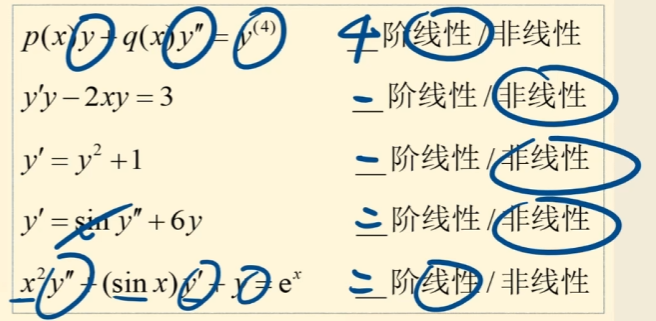

## 放起来没看的
* 三角函数中的万能公式
## 符号
* $[n]$: 意思是取整
    * $[-3] = -3$
    * $[\pi] = 3$
## 反函数
* 原函数: $y = f(x)$ 
* 反函数: $x = f(y)$(交换了`x` 和 `y`)
> 
> * 根据函数的定义, 必须要一个`x`对应一个`y`
> * 如果这个函数有反函数, 那么这个反函数也要一个`x`对应一个`y`, 因为反函数也是函数
> * 所以这个原函数必须要是`严格单调`

## 集合
* `A-B` 或 `A\B` 称为两个集合的差, 属于`A`而不属于`B`的元素的集合
* $\overline{A}$ 表示 A 的补集, 即不属于 A 的部分
## 三角函数
* `sin(Sine)`
* `cos(Cosine)`
* `tan(Tangent)`
* `cot(Cotangent)`: 和 `tan` 互为倒数
* `sec(Secant)`: 和 `cos` 互为倒数
* `csc(Cosecant)`: 和 `sin` 互为倒数

---
> 都能推出来, 包的
### 同角
* $\mathrm{sec^2x = 1 + tan^2x}$
* $\mathrm{csc^2x = 1 + cot^2x}$
### 倍角
* $\mathrm{sin2x = 2sinxcosx}$
* $\mathrm{cos2x = cos^2x-sin^2x = 2cos^2x-1}$
* $\mathrm{cos2x = cos^2x-sin^2x = 2cos^2x-1}$
* $\mathrm{tan2x = {{2tanx} \over {1-tan^2x}}}$ (自己尝试推时上下同除 `cos^2x`)
### 幂
* $\mathrm{sin^2x = {{1+cos2x} \over {2}}}$
* $\mathrm{cos^2x = {{1-cos2x} \over {2}}}$
* $\mathrm{tan^2x = {{1-cos2x} \over {1+cos2x}}}$
* 使用 $cos2x = 2cos^2x-1 = 1-2sin^2x$ 来推
### 半角
* 使用 幂 公式中 2x 替换为 x, x 替换为 x/2, 开方就能得到
* $\mathrm{sin{a \over 2} = \pm\sqrt{{1-cosa}\over{2}}}$
* $\mathrm{cos{a \over 2} = \pm\sqrt{{1+cosa}\over{2}}}$
* $\mathrm{tan{a \over 2} = \pm\sqrt{{1-cosa}\over{1+cosa}}}$
### 和差化积
* $\mathrm{sin(a \pm b) = sin(a)cos(b) \pm sin(b)cos(a)}$
* $\mathrm{cos(a + b) = cos(a)cos(b) - sin(b)sin(a)}$
* $\mathrm{sin(a - b) = cos(a)cos(b) + sin(b)sin(a)}$
* $\mathrm{tan(a+b) = {{tan(a) + tan(b)}\over{1-tan(a)tan(b)}}}$
### 积化和差
* 使用 `和差化积` 中的公式`相加`或者`相减`得到
* $\mathrm{sin(a)cos(b) = {1\over2}\{sin(a+b) + sin(a-b)\}}$ 
* $\mathrm{cos(a)cos(b) = {1\over2}\{cos(a+b) + cos(a-b)\}}$ 
* $\mathrm{sin(a)sin(b) = {1\over2}\{cos(a+b) - cos(a-b)\}}$ 
### 反三角
* 就是交换 三角函数中 `x` 和 `y`(输入和输出) 的位置
### 不等式(写下了, 但是还是不懂, 得取研究下)
* 三角不等式:
    * $||a|-|b|| \le |a \pm b| \le |a| + |b|$
* 算术几何不等式: 
    * $a^2 + b^2 \ge 2ab$
    * $|ab| \le {{a^2+b^2}\over{2}}$
    * $a_i \ge 0$, ${{a_1 + ... + a_n} \over n} \ge ^n\sqrt{a_1...a_n}$
* 柯西不等式(不懂的)
# 柯西不等式, 此为标记

# 汤家凤 2026 0基础--02 

# 下面是以前写的
## 微分方程
* `微分方程`: 含有自变量x, 未知函数y 及其$y^{'}$或更高阶`导数`的方程

* $y^{'}-{1 \over x} = -1$: 一阶微分方程
* $y^{''}+3y^{'} = 0$: 二阶微分方程

* `解法`: 对原式做积分

* `通解`: 积分后含常数 C 的解(C的个数和阶数相同, 对应做了几次积分)

* `特解`: 不含任意常数 或 常数确定后的解

* `线性微分方程`: y 和它的各阶导数都是一次方, 不能有y或者$y^{'}$相乘,且系数都为x

### 一阶线性方程(占比80%)
#### 可分离变量
* `形式`: $M(x)dx = N(y)dy$
    * (能写成 x 写在一边, y 写在另一边的形式)

* `解法`: 两边同时求积分, 记得 +C

* `答案形式`: 可以使用隐函数来表示
    * 例: $e_y+xy+sin(xy)=0$
>例: $\sqrt{1-x^2}y^{'} = \sqrt{1-y^2}$
>   
> > 将 $y^{'}$ 转换为 $\frac{dy}{dx}$     
> $= \sqrt{1-x^2}{dy \over dx} = \sqrt{1-y^2}$  
>  
> > 同时添加积分符号   
> $= \int \frac{dy}{\sqrt{1-y^2}} = \int \frac{dx}{\sqrt{1-x^2}}$  
>  
> > 这就是通解   
> $= arcsin(y) = arcsin(x)+C$   
> 
> 通解可以丢弃特殊情况, 在这个方程的情况下为 $y = \pm1$
#### 齐次方程
* `形式`: $\frac{dy}{dx} = f(\frac{y}{x})$ 
    * $\frac{y}{x}$ 都为整体出现

* `解法`: 令 $u = \frac{y}{x}$, 
则$ \frac{dy}{dx} = u + x\frac{du}{dx}$
, 转化为 $\frac{du}{g(u)-u} = \frac{dx}{x}$
    * `推导过程`:   
        * $u = \frac{y}{x}$
        * $y = ux$, 同时求导得  
        * $\frac{dy}{dx} = u + x\frac{du}{dx}$, 将$\frac{dy}{dx}$ 替换为 $u$, 将, $\frac{dy}{dx} = f(\frac{y}{x})$ 代入得: 
        * $ x\frac{du}{dx} = f(u) - u$, 调换顺序得
        * $ \frac{du}{f(u)-u} = \frac{dx}{x}$, 求积分得
        * $\int \frac{du}{f(u)-u} = \int \frac{dx}{x}+C$

### 二阶可降阶型

### n 阶线性微分方程

### 二阶常系数线性微分方程
