# 第一章 计算机网络体系结构
## 计算机网络的发展
### 第一阶段
* `ARPAnet` -- 美国国防部高级研究计划局(ARPA)设计一个分散的指挥系统 
    * `ARPAnet` 的下一代是 `Internet`

* `internet` -- (interconnected network)互联网
    * 1983年阿帕网接受 TCP/IP 选定 Internet 为设计的计算机通信系统
### 第二阶段 - 三级结构
* `NSFNET` -- 1985年起, 美国国家科学基金会 NSF 围绕6个大型计算机中心建设计算机网络, 即国家科学基金网 `NSFNET`  

### 第三阶段 - 多层次ISP结构
* `ISP(Internet Service Provider)` -- 因特网服务提供者 / 因特网服务提供商, 是一个向广大用户综合提供互联网接入业务, 服务业务和增值业务的公司, 如中国电信, 中国联通, 中国移动等, 分为主干ISP, 地区ISP和本地ISP
## 计算机网络的构成
* 工作方式
    * 边缘部分 用户直接使用
        * C/S方式 -- Client/Server
        * P2P方式 -- peer-to-peer
    * 核心部分 为边缘部分服务

* 功能组成
    * 通信子网 -- 实现数据通信
    * 资源子网 -- 实现资源共享 / 数据处理
 
* 资源子网 -> 应用层 
* 资源子网 -> 表示层
* 资源子网 -> 会话层
>意思是这三项为资源子网, 下面的通信子网也同理

* 传输层

* 通信子网 -- 网络层 -- 路由器
* 通信子网 -- 数据链路层 -- 交换机, 网桥
* 通信子网 -- 物理层 -- 集线器, 中继器
## 计算机网络的分类
* 按分布范围 -- `广域网WAN`, `城域网MAN`, `局域网LAN`, `个人区域网PAN`
    * 区分`广域网`和`局域网`
        * `广域网`使用交换技术
        * `局域网`使用广播技术

* 按使用者
    * 公用网
    * 专用网

* 按交换技术
    * 电路交换 -- 只能等别人使用完, 才能下一个人使用
    * 报文交换 -- 一次性传输一段报文
    * 分组交换 -- 分组传输报文的一部分, 多组传

* 按拓扑结构分
    * 总线型
    * 星型
    * 环形
    * 网状型

* 按传输技术分
    * 广播式网络 -- 共享公共通信信道
    * 点对点网络 -- 使用分组存储转发和路由选择机制
## 性能指标
### 速率
* 连接在计算机网络上的主机在数字信道上传输数据位数的速率
* 单位是 b/s, kb/s, Mb/s, Gb/s, Tb/s
### 时延
* 指数据(报文, 分组, 比特流)从网络(或链路)的一端传送到另一端所需的时间, 也叫延迟或迟延, 单位是s
* 分为四种
    * 发送时延(传输时延) -- 从发送分组的第一个比特算起, 到该分组的最后一个比特发送完毕所需的时间
    > $发送时延 = {{数据长度} \over {信道带宽(发送速率)}}$
    * 传播时延 -- 取决于电磁波传输速度和链路长度
    > $传播时延 = {{信道长度} \over {电磁波在信道上的传播速率}}$
    
    * 排队时延 -- 等待输出 / 入链路可用
    * 处理时延 -- 检错找出口
#### 要注意的
* 高速链路 -- 仅影响发送时延, 数据被推送到链路上的速度加快, 不会影响其他时延
### 时延带宽积
* 描述此时信道中有多少比特

>时延带宽积 = 传播时延 * 带宽 
### 往返时延RTT
* 从发送数据开始, 到发送方收到接收方的确认(立即确认)共经历的时延 

* RTT越大, 在收到确认之前, 可以发送的数据越多

* RTT包括
    * 往返传播时延 = 传播时延 * 2
    * 末端处理时间 
### 利用率
* 包括
    * 信道利用率
    >$信道利用率 = {{有数据通过时间} \over {(有+无)数据通过时间}}$
    * 网络利用率
    >$网络利用率 = 信道利用率加权平均值$
## 分层结构
* 实体 -- 第n层中的活动元素称为n层实体, 同一层的实体叫对等实体

* 协议 -- 为进行网络中的对等实体数据交换而建立的规则, 标准, 或约定称为网络协议(水平方向上) 

    * 语法 -- 规定传输数据的格式
    * 语义 -- 规定所要完成的功能
    * 同步 -- 规定各种操作的顺序

* 接口(访问服务点SAP(Service Access Point)) -- 上层使用下层服务的接口

* 服务 -- 下层为相邻上层提供的功能调用
    
    * SDU 服务数据单元 -- 为完成用户所要求的功能而应传送的数据
    * PCI 协议控制信息 -- 控制协议操作的信息 
    * PDU 协议数据单元 -- 对等层次之间传送的数据单位

    * PCI + SDU = PDU

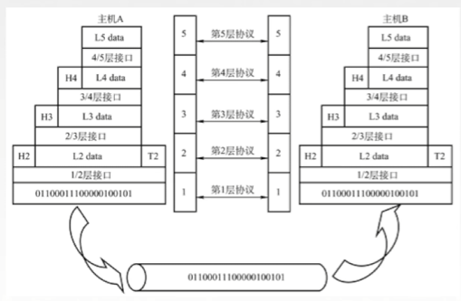
## OSI(法定标准)
* OSI(Open System Interconnect)
    * 理论成功, 市场失败

|七层||
|-|-|
|应用层|7|
|表示层|6|
|会话层|5|
|传输层|4|
|网络层|3|
|数据链路层|2|
|物理层|1|

>* 上面四层是端到端的通信, 下面四层是点到点的通信

* data数据从应用层开始打包, 每层打包后一直到`物理层`会传输到其他设备, 其他设备接收到数据后再层层解包为原始data数据

* 应用层 -- 所有能和用户交互产生网络流量的程序
    * 文件传输(FTP)(File Transfer Protocol)  
    * 电子邮件(SMTP)(Simple Mail Transfer Protocol)  
    * 万维网(HTTP)  

* 表示层 -- 用于处理两个通信系统中交换信息的表示方式
    * 数据格式变换 -- ...010101010... -> ${一张图片}
    * 数据加密解密
    * 数据压缩恢复

* 会话层 -- 向表示层 实体/用户 进程提供`建立连接`并在连接上有序地传输数据
    * 建立, 管理, 终止会话
    * 使用校验点使会话在通信失效时从 校验点/同步点继续恢复通信, 实现数据同步
        * 适用于传输大文件

* 传输层 -- 负责主机中两个进程的通信, 即端到端的通信, 传输单位是报文或用户数据报
    * 可靠传输, 不可靠传输 -- 区别有确认机制和需不需要提前建立连接
    * 差错控制 -- 纠错数据
    * 流量控制 -- 控制流量流速
    * 复用分用 
        * 在复用的情况下，多个应用程序的数据可以一起发送，通过不同的端口号来区分每个应用程序的数据流
        * 分用的情况下，一次只会发送一个应用程序的数据，然后根据端口号来将接收到的数据分发给正确的应用程序
        * 综合了 OSI 和 TCP/IP 的优点

* 网络层 -- 把分组从源端传输到目的端, 为分组交换网上的不同主机提供通信
* 网络层传输单位是`数据报`

* 功能一: 路由选择
* 功能二: 流量控制
* 功能三: 差错控制
* 功能四: 拥塞控制

 * 差错控制 -- 纠错
* 把网络层传下来的数据报组装成帧 拥_塞控制 -- 若所有节点都来不及比特传输接收分组, 而要丢弃大量分组的话, 网络就处于拥塞状态, 因此要采取一定措施, 缓解这种拥塞

* 数据链路层 -- 主要任务是把网络层传下的数据报组装成`帧`
    * 数据链路层/链路层的传输单位是`帧`
    * 成帧 (定义帧的开始和结束) 
    * 差错控制 (帧错+位错)
    * 流量控制
    * 访问(接入控制) `控制对信道的访问`

* 物理层 -- 在`物理媒体`上实现比特流的`透明传输`, 传输单位是`比特`
    * 透明传输 -- 不管数据是什么比特组合, 都应当能在链路上传输
    比特信号 -> 模拟信号

    * 定义接口特性
    * 定义传输模式 
        * 单工 -- 只能单向传输  
        * 半双工 -- 两边都可以作为发送方, 但是同一时间只能有一方传输
        * 双工 -- 可以双向同时说话
    * 定义传输速率
    * 比特同步
    * 比特编码
## TCP/IP 参考模型
|四层|
|-|
|应用层|
|传输层|
|网络层|
|数据链路层|
## 五层参考模型
* 综合了 OSI 和 TCP/IP 的优点

|五层||
|-|-|
|应用层|支持各种网络应用 _FTP, SMTP, HTTP_|
|传输层|进程-进程的数据传输 _TCP, UDP_|
|网络层|源主机到目的主机的数据分组路由和转发 _IP, ICMP, OSPF_|
|数据链路层|把网络层传下来的数据报组装成帧 _Ethernet, PPP_|
|物理层|比特传输|

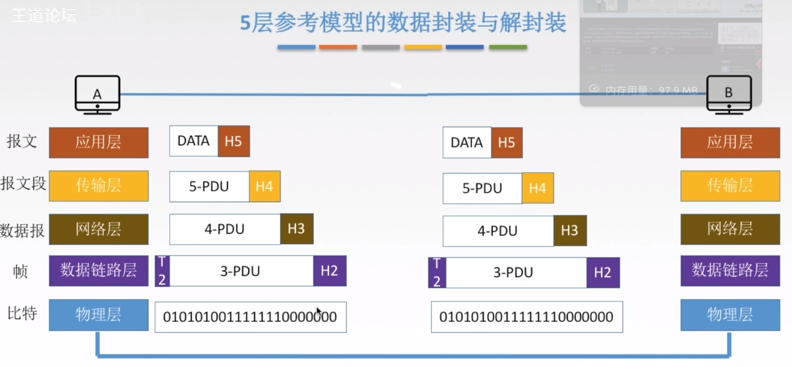
# 第二章 物理层
* 物理层解决如何在连接各种计算机的传输媒体上`传输数据比特流`, 而不是指具体的传输媒体

* 物理层主要任务: 确定与传输媒体接口有关的一些特性 -> 定义标准

1. `机械特性`: 定义物理连接的特性, 规定物理连接时所采用的规格, 接口形状, `引线数目, 引脚数量`和排列情况

2. `电气特性`: 规定传输二进制位时, 线路上信号的`电压范围`, 阻抗匹配, 传输速率和距离限制等

3. `功能特性`: 指明某条线上出现的某一电平表示什么意义, 接口部件的信号线的用途

4. `规程特性`: 定义各条物理线路的工作规程和时序关系
## 相关术语
* 信号:
    * `数字信号/离散信号`: 代表消息的参数的取值是离散的
    * `模拟信号/连续信号`: 代表消息的参数的取值是连续的

* `信源`: 产生和发送数据的源头
* `信宿`: 接收数据的终点
* `信道`: 信号的传输媒介, 一条通信线路往往包含一条发送信道和接受信道
## 三种通信方式 
* `单工通信`: 只有一个方向的通信没有反方向的交互, 仅需要`一条信道`

* `半双工通信/双向交替通信`: 通信的双方都可以发送或接受消息, 但任何一方都不能同时接收或发送, 需要`两条信道`(两条信道是因为`单条信道是单向的`)

* `全双工通信/双向同时通信`: 通信双方可以同时发送或接收消息, 也需要`两条信道`
## 数据传输方式(串行传输 & 并行传输)
* `串行传输`: 将表示一个字符的8位二进制数按`低位到高位`的顺序依次发送
    * 速度`慢`, 费用`低`, 适合`远距离`

* `并行传输`: 将表示一个字符的8位二进制数`同时通过8条信道传输`
    * 速度`快`, 费用`高`, 适合`近距离`
## 同步传输 & 异步传输
* `同步传输`: 数据的传送是以一个`数据区块`为单位, 因此同步传输又称为区块传输, 在传输数据时, 需先送出1个或多个同步字符, 再送出整批的数据

|syn|syn|char|char|char|
|-|-|-|-|-|
|同步字符|同步字符|数据|数据|数据|

* `异步传输`: 异步传输将比特分为小组进行传送, 小组可以是8位的1个字符或更长, 发送方可以在任何时刻发送这些比特组, 而接收方不知道他们会在什么时候到达, 传送数据时, 加一个字符起始位和一个字符终止位
## 码元
* 详细看原视频 2.1_3 (0:00 ~ 5:00)

* 码元: 
    * 每个状态都叫做`单个码元`
    * M 进制码元: 码元状态有 M 个
    * 1 码元可以携带多个比特的信息量
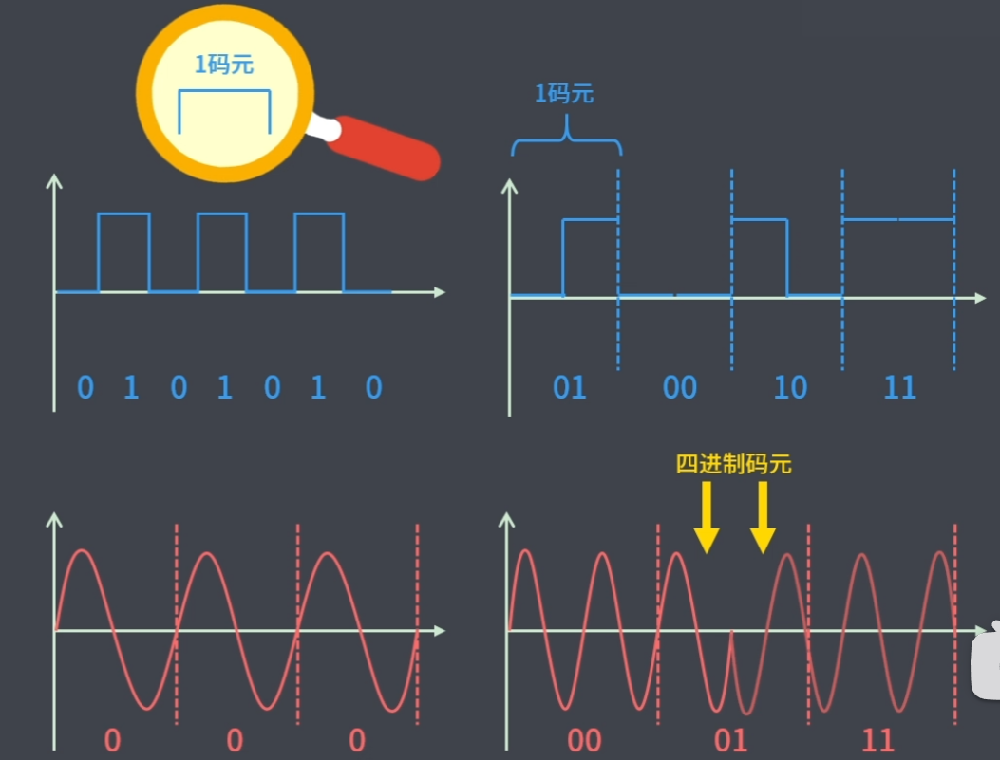

* 4进制码元 -> 码元的离散状态有4个, 4种高低不同的波形 -> 00, 01, 10, 11 -> 携带2比特的信息量
* 16进制码元 -> 码元的离散状态有16个,  16种高低不同的波形 -> 0000, 0001, ... , 1111 -> 携带4比特的信息量
## 数字通信系统数据传输速率的两种表示方法
* 可以用 `码元传输速率` 或 `信息传输速率` 表示

* 若一个码元携带 `n bit` 的信息量, 则 `M Baud` 的码元传输速率所对应的信息传输速率为` M * n bit/s `
### 码元传输速率
* 表示单位时间内数字通信系统所传输的码元个数(也可称为`脉冲个数或信号变化的次数`)

* 单位是波特(Baud), 1波特表示数字通信系统`每秒传输一个码元`

* `码元速率与进制数无关`, 只与码元长度有关
### 信息传输速率
* 表示单位时间内数字通信系统传输的`比特数`(即二进制码元数)
## 奈氏准则和香农定理
* `信道带宽`: 信道能通过的最高频率和最低频率之差
    * 出现最低频率是因为 `震动频率太低, 容易衰减`
    * 出现最高频率是因为 `震动太快导致码元界限不清楚`
    
* `码间串扰`: 接收端收到的信号波形`失去了码元之间清晰界限`的现象
### 奈氏准则(奈奎斯特定理)
* `奈氏准则`: 在理想低通(无噪声, 带宽受限)条件下, 为了避免码间串绕, 极限码元传输速率为 `2W Baud`, `W`是信道带宽, 单位为 `Hz`

* 理想低通信道下的的极限数据传输速率 = $2Wlog_2V$ (b/s)
    * V = 码元的离散种类数目
    * W = 带宽

* 在任何信道中, 码元传输的速率是有上限的, 若传输速率超过此上线, 就会出现严重的码间串扰问题, 使接收端对码元的完全正确识别成为不可能

* 信道的`频带(公式中的W)`越宽(即能通过的信号高频分量越多), 就可以用更高的速率进行码元传输

* 奈氏准则给出了码元传输速率的限制, 但没有对信息传输速率给出限制

* 由于码元的传输速率受奈氏准则的制约, 所以要提高数据的传输速率, 就必须设法使每个码元能携带更多个比特的信息量, 这就需要多元制的调制方法
> 例. 在无噪声的情况下, 若某通信链路的带宽为3kHz, 采用4个相位, 每个相位具有4种振幅的QAM调制技术, 则该通信链路的最大数据传输率是多少
> * 因为有4个相位, 每个相位有4种振幅, 所以有16种码元
极限速率 = 2(常数) * 3k(带宽) * $log_216$ = 2 * 3k * 4 = 24kb/s
### 信噪比
* `信噪比` = `信号平均功率` / `噪声平均功率`, 记为 S/N, 使用分贝(dB)作为度量单位, 记作
$$信噪比(dB) = 10log_{10}(S/N)$$

* 信噪比有两种表示方式, 比值(S/N), db(分贝单位), 使上面的公式可以使`比值`和`db`进行换算
### 香农定理
* `香农定理`: 在带宽受限且有噪声的信道中, 为了不产生误差, 信息的数据传输速率有上限值
    
    * 信道的`带宽W`或信道中的`信噪比`越大, 则信息的极限传输速率`越高`
    
    * 对一定的`传输带宽`和一定的`信道比`, 信息传输速率的上限就确定了

    * 只要信息的传输速率低于信道的极限传输速率, 就一定能找到某种方法来实现`无差错的传输`

    * 香农定理得出的为极限信息传输速率, 实际信道能达到的传输速率要比它低不少
$$信道的极限数据传输速率 = Wlog_2(1+S/N)(b/s)$$
>例. 电话系统的典型参数是信道带宽为3000hz, 信噪比为30db, 则该系统最大的数据传输速率为
> * $30dB = 10log_{10}(S/N)$
> * 得$ S/N = 1000 $
> * $result = 3000hz * log_2(1+1000) \approx 30kb/s$
### 总结
* 奈氏准则
    * 带宽受限无噪声的条件下, 为了避免码间串扰, 码元的传输速率上限为 `2W Baud`
    
    * 理想低通信道下的极限传输率 = $2Wlog_2V$
    
    * 要想提高数据率, 就要提高`带宽`/`采用更好的编码技术`
* 香农定理
    * 带宽受限有噪声条件下的信息传输速率

    * 信道的极限传输速率 = $Wlog_2(1+S/N)$
        * W表示带宽
    * 要想提高数据率, 就要提高`带宽/信噪比`
#### 做题时
* 如果题目中给了`噪声`的条件, 就用`香农定理` 
* 给了`码元的离散数量`就用`奈氏准则`, 
* 如果两个条件都给了, 两个公式都算一下, 取最小值
> 例. 二进制信号, 在信噪比为127:1的4kHz信道上传输, 最大的数据速率可达到多少
> * 二进制信号表示码元的离散数量有两种
> * 奈氏准则: $2 * 4k*log_22 = 8000b/s$
> * 香农定理: $4k * log_2(1+127) = 28000b/s$
> * 使用两种定理时选择较小的值作为最大速率, 所以答案为8000b/s
## 基带信号和宽带信号
* `基带信号`: 没有调制过的传输信息的信号, 如说话的声波, 计算机输出的信号

* `宽带信号`: 基带信号调制后就是宽带信号
## 编码与调制
* 区分`编码`和`调制`
    * 数据被`转化成数字信号就是编码`
    * 数据被`转化成模拟信号就是调制`
### 数字数据编码为数字信号
* `非归0编码(NRZ)`
    * 1为高电平, 0为低电平
    * 编码容易实现, 没有检错功能, 无法判断一个码元的开始和结束, 以至于难以同步

* `归0编码(RZ)`
    * 和 `NRZ` 不是完全相反, 在每个码元的结束都要恢复为0

* `反向不归0编码(NRZI)`
    * 用电平的变化来区分码元
    * 电平翻转表示0, 不变表示1

* `曼彻斯特编码`
# 第三章 数据链路层
* 数据链路层负责通过一条链路从一个结点向另一个物理链路直接连接的相邻结点传送数据报

* 名词概念
    * `结点`: 主机, 路由器
    * `链路`: 网络中两个结点之间的`物理通道`, 链路的传输介质主要有双绞线, 光纤和微波, 分为有线链路, 无线链路
    * `数据链路`: 网络中两个结点之间的`逻辑通道`, 把实现控制数据传输协议的硬件和软件加到链路上就构成数据链路 
    * `帧`: 链路层的协议数据单元, 封装网络层数据报

* `功能概述`: 其最基本的服务是将源自网络层来的数据`可靠`地传输到相邻节点的目标机网络层, 将物理层提供的可能出错的物理连接改造成为`逻辑上无差错的数据链路`

* `功能一`: 为网络层提供服务, `无确认无连接服务`, `有确认无连接服务`, `有确认面向连接服务`
    * `无确认无连接服务`: 传输数据前不提前建立连接, 接收端也不同返回确认
    * `有确认无连接服务`: 不需要提前建立连接, 接收端需要返回确认, 如果一段时间没有返回确认, 则会重新发送刚刚的数据   
    * `有确认面向连接服务`: 需要提前建立连接, 接收端每接收一段数据都要返回确认
* `功能二`: 链路管理, 即连接的建立, 维持, 释放(用于面向连接的服务)
* `功能三`: 组帧
* `功能四`: 流量控制
* `功能五`: 差错控制(帧错/位错)
## 封装成帧
* 封装成帧: 在一段数据的前后部分添加`首部`和`尾部`, 接收端在收到物理层上交的比特流后, 就能根据首部和尾部的标记, 从收到的比特流中识别帧的开始和结束
* 首部和尾部包含许多的控制信息, 它们的重要作用: `帧定界`(确定帧的界限)

* `帧同步`: 接收方: 应当能从接收到的二进制比特流中区分出帧的起始和终止
* `组帧的四种方法`
    * `字符计数法`: 帧首部使用一个计数字段(第一个字节, 八位)来标明帧内字符数
        * 当一个计数字段出错后会影响后面的数据, 所以容易出错, 不常用
    
    * `字符(节)填充法`: 在要传输的数据的首尾部添加协议定义的开始符和结束符, 将数据中可能被识别为开始符和结束符的地方添加转义字符, 使其不会被识别为控制信息, 接收端接收时在处理掉转义字符
    
    * `零比特填充法`
        * 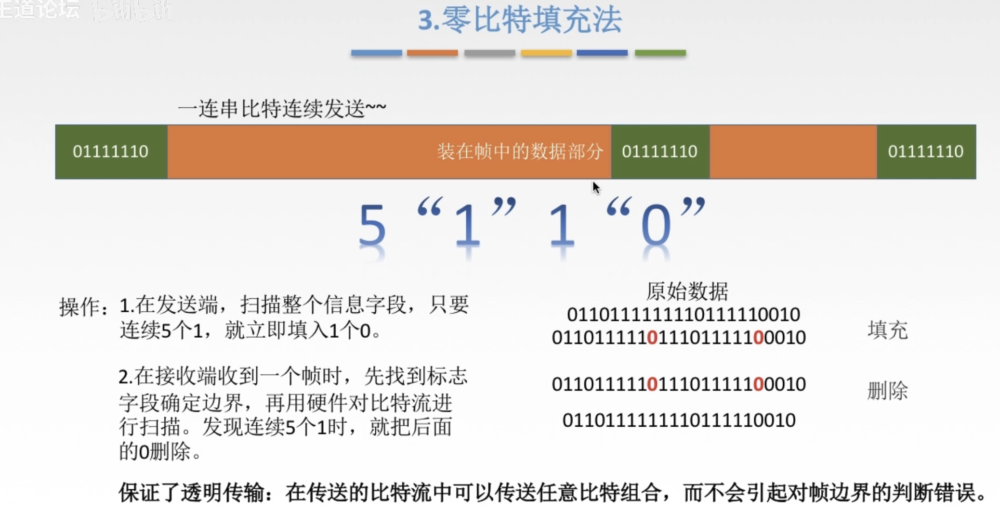
    
    * `违规编码法`: 使用不会用到的字符来定界
    * 由于字节计数法中 Count 字段的脆弱性(值若有差错就会造成灾难性后果)及字符填充实现上的复杂性和不兼容性, 目前较普遍使用的帧同步法是`比特填充法`和`违规编码法`

## 透明传输
* 透明传输: 不管所传数据是什么样的比特组合, 都应当能够在链路上传输, 因此, 链路层就"看不见"有什么妨碍数据传输的东西
* 当所传数据中的比特组合恰巧与某一控制信息完全一样时, 就必须采取适当的措施, 接收方不会将这样的数据误认为是某种控制信息, 这样才能保证数据链路层的传输是透明的
## 奇偶校验码
* 使用奇校验 -> `1` 的个数为奇数
* 使用偶校验 -> `1` 的个数为欧数

## CRC循环冗余码
* 难解释, 闲了再补全
    * 在3.3_1 差错控制

# 该看3.3_2 

# 第四章 网络层
* 主要任务是把`分组`从源端传到目的端, 为分组交换网上的不同主机提供通信服务

* 网络层传输单位是`数据报`
* 功能
    * `功能一`: 路由选择与分组转发(选择`最佳路径`) 
    * `功能二`: 异构网络互联
    * `功能三`: 拥塞控制(若所有节点都来不及接受分组, 而要丢弃大量分组的话, 网络就处于拥塞状态, 因此要采取一定措施, 缓解这种拥塞)
* `数据平面`: 根据转发表进行转发, 这是路由器的本地动作
## 传统控制方法
* `控制平面(传统方法/每路由器法)`: 路由选择算法运行在每台路由器中, 并且每台路由器都包含转发和路由选择两种功能
    * `具体方法`: 在一台路由器中的路由选择算法与其他路由器进行通信, 计算出路由表和转发表
* `数据平面`和`控制平面`之间的关系类似于`执行`和`指挥`, 数据平面负责实际的数据传输和处理, 控制平面负责管理和配置网络设备，定义数据平面中的规则和策略
## SDN(Software-Defined Networking)
* `控制平面从路由器上物理上分离`, 路由器仅实现转发, `远程控制器`计算和分发转发表以供每台路由器使用

* 控制平面
    * `SDN控制器`: 维护准确的网络状态信息, 为运行在控制平面中的网络控制应用程序提供信息
    * 网络控制应用程序: 根据SDN控制器提供的方法, 这些应用程序通过这些方法能够监视, 编程和控制下面的网络设备
* `具体方法`: 路由器通过交换包换转发表和其他路由选择信息的报文与`远程控制器`通信, 因为计算转发并与路由器交互的控制器是用软件实现的, 所以网络是`"软件定义的"`
### SDN控制器的三个层次
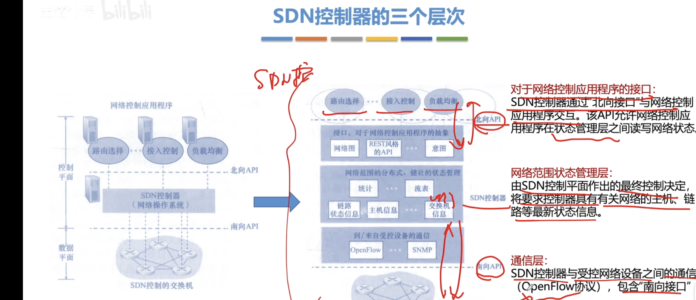
# 4.2没看, 弹幕说先看4.3
## IP数据报格式
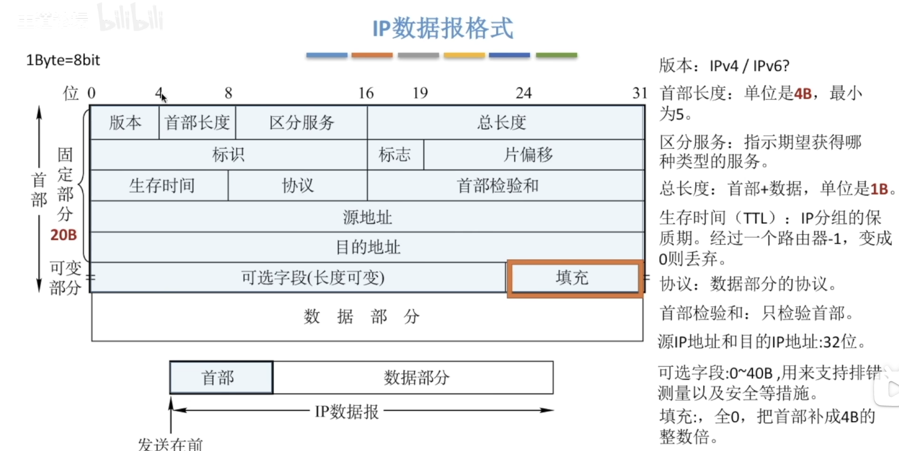
# 该看4.3.2
# 第五章 传输层
* `功能一`: 传输层提供进程和进程之间的逻辑通信
* `功能二`: 复用和分用
    * `复用`: 多个进程都使用传输层的一个协议进行传输
    * `分用`: 将传来的报文段送交给对应的进程
* `功能三`: 传输层对收到的报文进行差错检测

* `TCP`: 可靠, 面向连接, 时延大, 适用于大文件 
* `UDP`: 不可靠, 无连接, 时延小, 适用于小文件

* `端口号`
    * 传输层使用逻辑端口来标识主机中的应用程序
    * 端口号长度为 `16bit`, 能表示65536个不同的端口号

* `端口号(按范围分)`
    * `服务端使用`
        * `熟知端口号(0~1023)`: 给 TCP/IP 最重要的一些应用程序, 让所有用户都知道
        * `登记端口号(1024~49151)`: 为没有熟知端口号的应用使用的
    * `客户端使用(49152~65535)`: 仅在客户进程运行时才动态选择

|应用程序|FTP|TELNET|SMTP|DNS|TFTP|HTTP|SNMP|
|-|-|-|-|-|-|-|-|
|熟知端口号|21|23|25|53|69|80|161|

* 在网络中采用发送方和接收方的套接字组合来识别端点, `套接字`唯一标识了网络中的一个主机和它上面的一个进程
    * `套接字Socket = (主机IP地址, 端口号)`
## UDP
* UDP 只在 IP数据报服务之上增加了 `复用分用` 和 `差错检测` 功能
* 特点
    * UDP 是`无连接`的, 减少开销和发送数据之前的时延
    * UDP 使用最大努力交付, 即不保证可靠交付
    * UDP 是面向报文的, 适合一次性传输少量数据的网络应用
    * UDP 没有拥塞控制, 适合很多实时应用
    * UDP 首部开销小, 8B, TCP要20B
### UDP首部格式
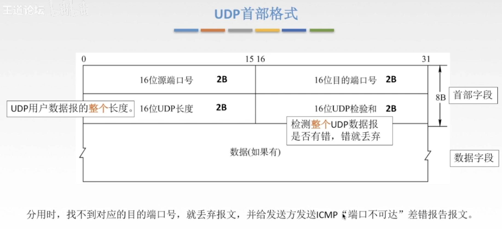
### UDP校验
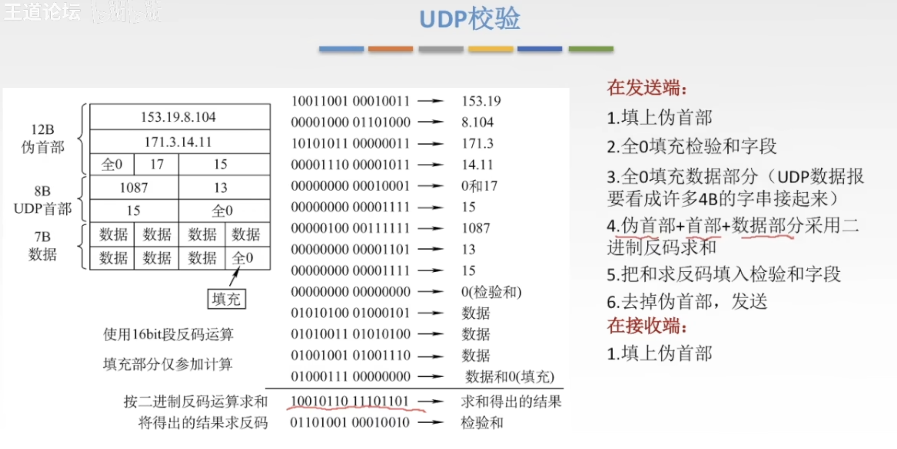
## TCP
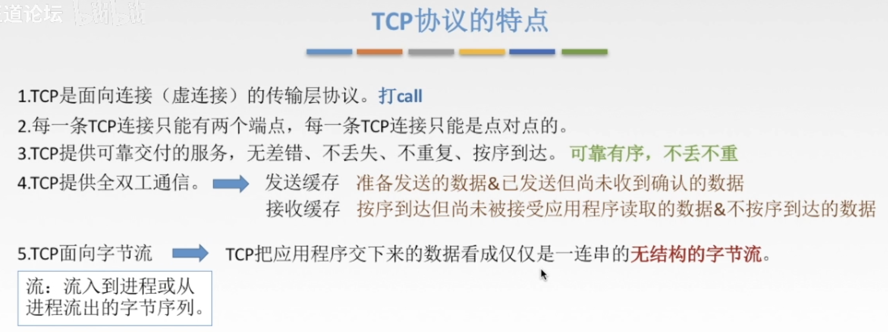
### 首部格式(等准备考研再写)
### TCP的连接建立(三次握手)
* 见extra
# 第六章 (finished)
## DNS(Domain Name System)
|www.|baidu.|com|
|-|-|-|
|三级域名|二级域名|顶级域名|

* 顶级域名
    * 国家顶级域名 cn, us, uk
    * 通用顶级域名 com, net, org, gov, int, aero, museum, travel
    * 基础结构域名/反向域名 arpa
* 二级域名
    * 类别域名 ac, com, edu, gov, mil, net, org
    行政区域名 用于我国各省, 自治区, 直辖市 bj, js
* 三级域名
* 四级域名
### 域名服务器
* 根域名服务器
* 顶级域名服务器: `org`, `com`, `edu`
* 权限域名服务器: `abc.org`, `y.abc.org`
* 本地域名服务器: 当一个主机发出DNS请求时, 这个查询请求报文就发给本地域名服务器 
### 域名解析过程
#### 递归查询
* 本地域名服务器查询不到后, 查询根域名服务器, 根域名服务器查询不完整后, 再由根服务器继续发送查询请求, 查询到完整的ip后, 由最后查询的服务器一级一级返回到本地域名服务器
#### 迭代查询
* 和递归查询不同, 当根域名服务器查询不完整后, 再由本地域名服务器向下一级发送请求
## FTP(File Transfer Protocol)
* FTP 是基于 客户/服务器`(C/S)`的协议
* FTP 使用TCP实现可靠传输

* 使用两个端口进行工作, 一个端口负责控制连接`(21端口)`, 一个端口负责数据连接`(20端口)`
    * 控制连接始终保持
    * 数据连接保持一会
    * 是否使用TCP 20端口建立数据连接和`传输模式`有关
        * `主动模式`使用TCP 20端口
        * `被动模式`由服务器和客户懂自行协商决定(端口 > 1024)
## 电子邮件
### SMTP(简单邮件传送协议)
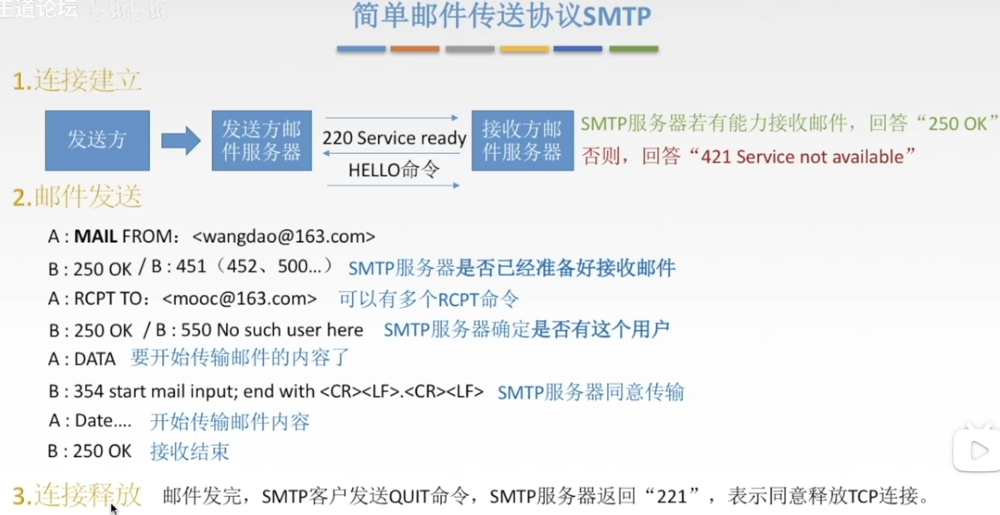
* 缺点  
    * SMTP 不能传送可执行文件或者其他二进制对象
    * SMTP 仅限于传送7位ASCII码, 不能传送其他非英语的文字
    * SMTP 服务器会拒绝超过一定长度的文件
### MIME
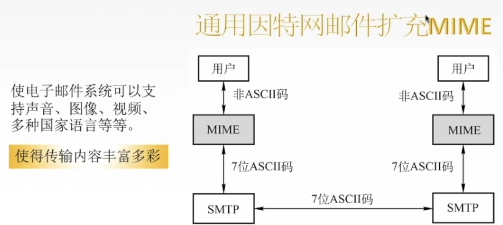
* 将其他非ASCII码转换为ASCII码再传输
### POP3(邮局协议)
* TCP连接, 端口号110, C/S
* 工作方式
    * 下载并保留(在服务器)
    * 下载并删除
### IMAP(网际报文存取协议)
* 当用户PC上的IMAP客户程序打开IMAP服务器的邮箱时, 用户可以看到邮件的首部, 当用户尝试打开邮件时, 邮件才会上传到PC上
## 万维网
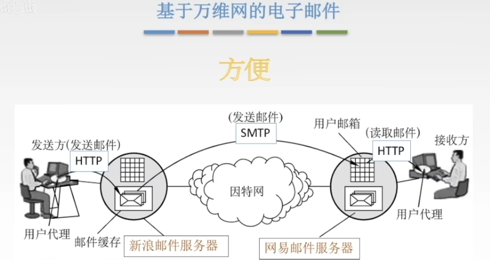
* URL一般格式:
    * <协议>://<主机>:<端口>/<路径>
* 用户点击超链接获取资源, 这些资源通过超文本传输协议(`HTTP`)传送给使用者 
* 万维网以`客户/服务器`方式工作, 用户使用的浏览器就是万维网客户程序, 万维网所主流的主机运行服务器程序
## HTTP
* HTTP协议定义了浏览器(万维网客户进程)怎样向万维网服务器请求万维网文档, 以及服务器怎样把文档传达给浏览器
* 具体过程
    1. 浏览器分析URL
    2. 浏览器向DNS请求解析IP地址
    3. DNS解析出IP地址
    4. 浏览器与服务器建立TCP连接
    5. 浏览器发出取文件命令
    6. 服务器响应
    7. 释放TCP连接
    8. 浏览器显示
* HTTP协议是无状态的, 使用Cookie来识别用户
* HTTP采用TCP作为运输层协议, 但HTTP协议本身是无连接的(通信双方在交换HTTP报文之前不需要先建立HTTP连接)
### HTTP的连接方式
* 连接方式
    * 持久连接(Keep alive): 仅需握手一次, 连接会保持
        * 非流水线: 多个请求连接时, 处理完一个请求才能处理另一个请求
        * 流水线: 可以同时处理多个请求连接
    * 非持久连接(Close): 每次请求都需要进行握手
### 报文结构
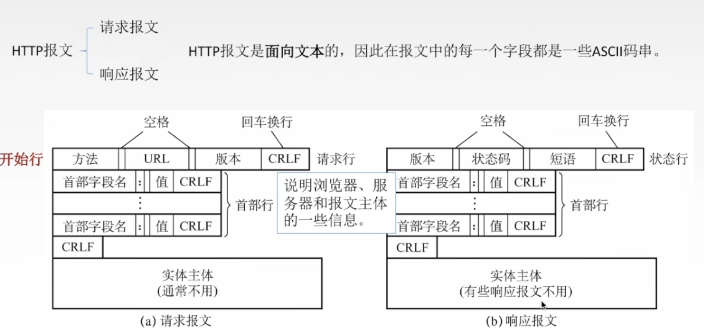 
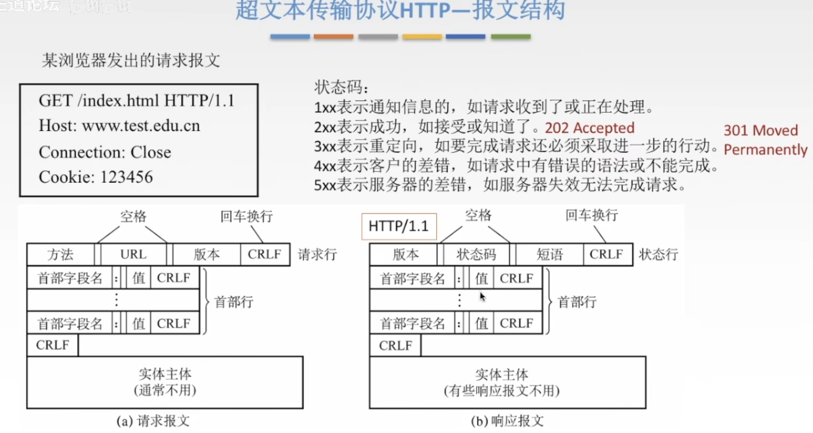
