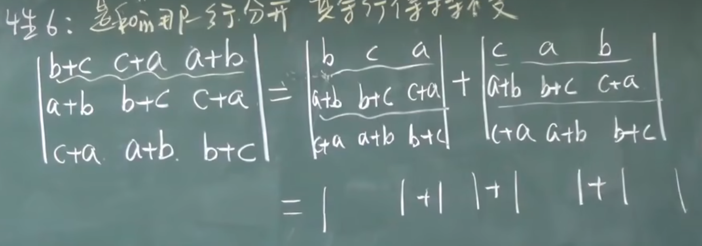
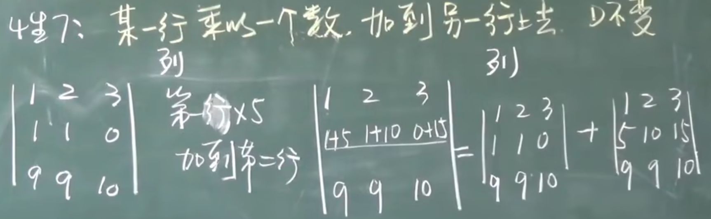
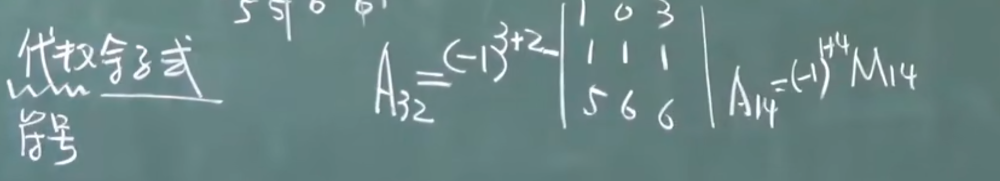
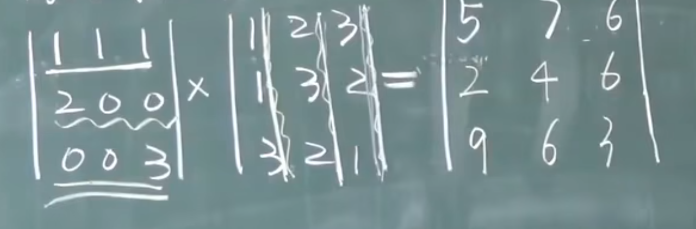
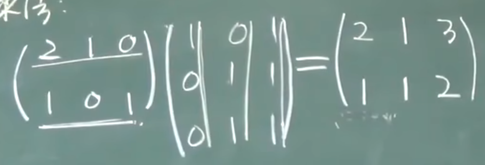

## 行列式 和 矩阵 对比
* 行列式拆分时一次只能拆一行

$\left| \begin{matrix}  
1 & 2 \\
a & b 
\end{matrix} \right|$
+
$\left| \begin{matrix}  
1 & 2 \\
x & y 
\end{matrix} \right| = $
$\left| \begin{matrix}  
1 & 2 \\
a+x & b+y 
\end{matrix} \right|$  

* 行列式提公因项只能提一行

2
$\left| \begin{matrix}  
1 & 2 \\
a & b 
\end{matrix} \right| = $
$\left| \begin{matrix}  
1 & 2 \\
2a & 2b 
\end{matrix} \right|$

* 矩阵加减作用于全部

$\left[ \begin{matrix}  
1 & 2 \\
a & b 
\end{matrix} \right]$
+
$\left[ \begin{matrix}  
1 & 2 \\
x & y 
\end{matrix} \right] = $
$\left[ \begin{matrix}  
2 & 4 \\
a+x & b+y 
\end{matrix} \right]$  

* 矩阵提公因式是全部提出来

2
$\left[ \begin{matrix}  
1 & 2 \\
a & b 
\end{matrix} \right] = $
$\left[ \begin{matrix}  
2 & 4 \\
2a & 2b 
\end{matrix} \right]$

## 行列式, 排列
* AB != BA
* 矩阵不能放在分母上
* (n-1) + (n-2) + ... + 2 + 1 = n(n-1) / 2 
### 二阶行列式
$\left[ \begin{matrix}  
a & b \\
c & d 
\end{matrix} \right]$
$= ad - cb $
### 三阶行列式
$\left| \begin{matrix}  1 & 2 & 3 \\  4 & 5 & 6 \\ 7 & 8 & 9  \end{matrix} \right| $  
$= (1*5*9) + (2*6*7) + (4*8*3) - (3*5*7) + (6*8*1) + (2*4*9)$
### 排列  
* 排列 -- 由1, 2, ... ,n 组成的有序数组， 叫n级排列
    * 有序指的是固定顺序
        > 例 -- 3级排列包含 (1, 2, 3), (2, 1, 3), (3, 1, 2) 等等
    * 中间不能缺数
        > 例 --  4, 1, 5, 3 不是5级排列, 因为数组不包括2
    
    * n级排列共有 $n!$ 种

* 逆序 -- 大数排在小数前面
* 逆序数 -- 逆序的总数
    > 例 (4, 2, 1, 3)的逆序数  
    从4开始看, 4>2, 4>1, 4>3, 这是3个逆序  
    再看2, 2>1, 2<3, 这是1个逆序  
    再看1, 没有  
    所以逆序数为 3+1 = 4

* 偶排列, 奇排列 -- 逆序数为奇数或偶数则为对应的`偶排列`或`奇排列`

* 标准(自然)排列 -- 顺序为(1, 2, ..., n)的排列 
    * 标准排列的逆序数为 n(n-1)/2

* 对换 -- 交换两个数
* 定理1.1.1 -- 一个排列经过一次对换, 奇偶性改变
* 定理1.1.2 -- n级排列中, 奇偶排列各占一半
### n阶行列式
#### 三角行列式
$ D = \left| \begin{matrix} 1 & 0 & 1 & 3 \\ 0 & 3 & 2 & 5 \\0 & 0 & 8 & 6 \\ 0 & 0 & 0 & 6\end{matrix} \right| = 1 * 3 * 8 * 6$   
### 行列值的性质
#### 转置
$ D = \left| \begin{matrix}  0 & 1 & 3 \\  3 & 2 & 5 \\ 7 & 8 & 6  \end{matrix} \right|$   

$ D^T= \left| \begin{matrix}  0 & 3 & 7 \\  1 & 2 & 8 \\ 3 & 5 & 6  \end{matrix} \right|$
> 列变为行, 行变为列
#### 性质
* 性质:
    0. 对行成立的性质对列也成立

    1. $D^T = D$

    2. 两行互换, 值变号 

    3. 两行(列)相等, D = 0

    4. 某一行有公因子, 可以提到行列式外面去

    5. 两行对应成比例, D = 0
        * 推论: 某一行全为0, D = 0

    6. 行列式的某一行(列)是两数之和, 则此行列式可以表示为两行列式的和
        * 是和的那行(列)分开, 其余行不变
         

    7. 某一行(列)乘以一个数, 加到另一行(列)上去, D 不变
        
#### 解四阶行列式
* 思路一
    * 如果题目中 0 很少, 一般思路为转换为上三角行列式
        * 主要是使用上面的`性质7`, 少量使用`性质2`

* 思路二
    * 行列式D = 任意列(行)元素与对应的`代数余子式`相乘的结果之 和  

* 具体看[1.4 行列式的计算](https://www.bilibili.com/video/BV1aW411Q7x1/?p=5&share_source=copy_web&vd_source=6fcaeb589ebc683e202dd787a3b58143)
### 行列式按行(列)展开
#### 余子式
* $M_{32}$表示去掉x=3, y=2, 对应的`行`和`列`形成的子行列式


#### 代数余子式
* 相比于`余子式`多了正负号, -1的上标为 坐标对应的xy相加


#### 定理
* 定理1: (按某行(列)展开)    
    * 行列式D = 任意列(行)元素与对应的`代数余子式`相乘的结果和  
    $D = a_{i1}A_{i1} + a_{i2}A_{i2} + ... + a_{in}A_{in}$
> $\left| \begin{matrix}  
> 1 & 4 & 3 & 7 \\
> 4 & 5 & 6 & 8 \\
> 7 & 8 & 9 & 2 \\
> 7 & 8 & 5 & 5
> \end{matrix} \right| $  
> =(按第一行展开) $1 * A_{11} + 4 * A_{12} + 3 * A_{13} + 7 * A_{14}$ 
#### 拉普拉斯定理 
* 当尝试使用按行(列)展开时, 选中两行和两列, 确定一个二阶子式, 再求出这个二阶子式的代数余子式, 展开时与直接按行(列)展开的原理一样  

* [这个讲得很明白](https://www.bilibili.com/video/BV1my4y1a7pD/?share_source=copy_web&vd_source=6fcaeb589ebc683e202dd787a3b58143)
#### 行列式相乘规则
* 下面这种方法`仅适用于同阶行列式`, 不同阶行列式相乘需要用`其他方法`, 比如`算出两个行列式具体的值`再相乘
* 步骤
    * 乘号`左边行列式第一行所有元素`分别乘`乘号右边第一列所有元素`再相加能得到结果行列式的单个元素
    * 完成结果行列式的所有元素
    
### 行列式的计算
#### 解四阶行列式
* 上三角
    * 如果题目中 0 很少, 一般思路为转换为上三角行列式
        * 主要是使用上面的`性质7`, 少量使用`性质2`

* 按行展开
    * 行列式D = 任意列(行)元素与对应的`代数余子式`相乘的结果之 和  

* 具体看[1.4 行列式的计算](https://www.bilibili.com/video/BV1aW411Q7x1/?p=5&share_source=copy_web&vd_source=6fcaeb589ebc683e202dd787a3b58143)

#### 特殊行列式
##### 对角线为x, 其余皆为a
$ D = \left| \begin{matrix} 
x & a & ... & a \\
a & x & ... & a \\
... & ... & x & ... \\
a & a & ... & x
\end{matrix} \right| $ 


##### 三叉型行列式
$ D = \left| \begin{matrix} 
1+a_1 & 1 & ... & 1 \\
1 & 1+a_2 & ... & 1 \\
... & ... &  & ... \\
1 & 1 & ... & 1+a_n
\end{matrix} \right| $   
* 需要使用`加边法`

###### 加边法
$ D = \left| \begin{matrix} 
1+a_1 & 1 & ... & 1 \\
1 & 1+a_2 & ... & 1 \\
... & ... &  & ... \\
1 & 1 & ... & 1+a_n
\end{matrix} \right| $   

$ = D_1 = \left| \begin{matrix} 
1 & 1 & 1 & ... & 1 \\
0 & 1+a_1 & 1 & ... & 1 \\
0 & 1 & 1+a_3 & 1 & 1\\
... & ... & ... & 1+a_4 & 1 \\
0 & 1 & 1 & ... & 1+a_n
\end{matrix} \right| $   
* 证明: 尝试将 D_1 使用第一行按行展开, 发现等于 D 这个四阶行列式 `(性质五: 推论: 某一行全为0, D = 0)`
##### 范德蒙德行列式
$ D = \left| \begin{matrix} 
1 & 1 & ... & 1 \\
x_1 & x_2 & ... & x_n \\
x_1^2 & x_2^2 &  & x_n^2 \\
x_1^3 & x_2^3 & ... & x_n^3 
\end{matrix} \right| = 
{II}_{i>j}(X_i-X_j)$
* 例:
$ D = \left| \begin{matrix} 
1 & 1 & 1 & 1 \\
a & b & c & d \\
a^2 & b^2 & c^2 & d^2 \\
a^3 & b^3 & c^3 & d^3 
\end{matrix} \right| $  

$ = (d-a)(d-b)(d-c)(c-a)(c-b)(b-a) $
* [实在看不懂了看一眼能让我看懂的视频](https://www.bilibili.com/video/BV1ts4y1V7s2/?share_source=copy_web&vd_source=6fcaeb589ebc683e202dd787a3b58143)
##### 对称行列式/反对称行列式
###### 对称行列式
$ D = \left| \begin{matrix} 
1 & 1 & -1 \\
1 & 2 & 0 \\
-1 & 0 & 3 
\end{matrix} \right| $
* 主对角线元素无要求
* 上下位置对应相等
###### 反对称行列式
$ D = \left| \begin{matrix} 
0 & 1 & 2 & 3 \\
-1 & 0 & -5 & 6 \\
-2 & 5 & 0 & 8 \\
-3 & -6 & -8 & 0 
\end{matrix} \right| $
* 特点
    * 主对角线全为0
    * 上下位置对应成相反数

* 如果是奇数阶, D = 0
* 偶数阶只能正常算
##### 对角线皆为 1+a_1
$ D = \left| \begin{matrix} 
1+a_1 & a_1 & ... & a_1 \\
1 & 1+a_2 & ... & 1 \\
... & ... &   & ... \\
1 & 1 & ... & 1+a_n 
\end{matrix} \right| $

### 克莱姆法则
* 仅适用于`方程个数 = 未知量的个数`

$  \begin{cases}
X_1 + X_2 + X_3 = a \\
X_1 - X_2 + 5X_3 = b & a, b, c 已知\\
-X_1 + X_2 + 6X_3 = c 
\end{cases} $  

* $X_j = {{D_j} \over {D}}$

* 系数行列式 D = 
$\left| \begin{matrix}  
1 & 1 & 1 \\
1 & -1 & 5 \\
-1 & 1 & 6  
\end{matrix} \right|$

* $D_1$ = 
$\left| \begin{matrix}  
a & 1 & 1 \\
b & -1 & 5 \\
c & 1 & 6  
\end{matrix} \right|$

* $D_2$ = 
$\left| \begin{matrix}  
1 & a & 1 \\
1 & b & 5 \\
-1 & c & 6  
\end{matrix} \right|$

* $D_3$ = 
$\left| \begin{matrix}  
1 & 1 & a \\
1 & -1 & b \\
-1 & 1 & c  
\end{matrix} \right|$
## 矩阵
* 是一些数按行按列构成的数表, 记作 $A_{m*n}$
* 数表使用 `()` 或 `[]` 括起来

### 单位矩阵
* 使用 `E` 或 `I` 来表示
* 对角线均为下标
* 除对角线外均为 0

$E_3$ = 
$\left( \begin{matrix}  
1 & 0 & 0 \\  
0 & 1 & 0 \\ 
0 & 0 & 1  
\end{matrix} \right)$
### 0 矩阵
* 两个0矩阵不一定相等
* 可能是

$\left( \begin{matrix}  
0 & 0 & 0 \\  
0 & 0 & 0 \\ 
0 & 0 & 0  
\end{matrix} \right)$
* 也可能是
$\left( \begin{matrix}  
0 & 0 & 0 \\  
0 & 0 & 0  
\end{matrix} \right)$
### 矩阵运算
#### 加(减)法 -> 对应元素相加(减)
* 只有同型矩阵才能相加减    
#### 数乘运算
* 矩阵所有元素均有`公因子`, 公因子外提一次
* 和行列式有区别的, 行列式一行(列)提一次
#### 矩阵乘法
* AB 之间有 `左乘`, `右乘`的区别
* 矩阵操作, 设有初等矩阵A, 一般矩阵P
    * AP 表示对 P 进行A对应的`行`操作
    * PA 表示对 P 进行A对应的`列`操作
* 性质
    * AB = 0, 推不出 A = 0 或 B = 0
    * AB = AC, A != 0, 推不出 B = C

    * 0矩阵和任意矩阵相乘都为0
        * $A_{4*3} * 0_{3*2}$ = $0_{4*2}$ 

* 宋浩的七字口诀 = `中间相等取两边`
* 例: $A_{4*6} * A_{6*5}$
    * 因为 中间的 6 和 6 相等, 所以这两个矩阵可以相乘, 矩阵的大小是 4*5    
    
#### 幂运算
* 规定 $A^0 = E$
#### 验证是否是对称矩阵
* 矩阵对称 = 证明 $A^T = A$
### 特殊矩阵
#### 数量矩阵
$bE = \left( \begin{matrix}  
b & 0 & 0 & 0 \\
0 & b & 0 & 0 \\
0 & 0 & ... & 0 \\ 
0 & 0 & 0 & b  
\end{matrix} \right)$

$\left( \begin{matrix}  
2 & 0 & 0 \\
0 & 2 & 0 \\
0 & 0 & 2  
\end{matrix} \right)$ + $\left( \begin{matrix}  
3 & 0  & 0 \\
0 & 3 & 0 \\
0 & 0 & 3  
\end{matrix} \right) = \left( \begin{matrix}  
5 & 0  & 0 \\
0 & 5 & 0 \\
0 & 0 & 5  
\end{matrix} \right)$
#### 对角型
* 可以写作 diag($a_1, a_2, ..., a_n$)
* $\left( \begin{matrix}  
a_1 & 0 & 0 & 0\\
0 & a_2 & 0 & 0\\
0 & 0 & ... & 0\\
0 & 0 & 0 & a_n 
\end{matrix} \right)$
#### 对称矩阵
* 对角线上对应元素相等
* $\left( \begin{matrix}  
1 & 1 & -1\\
1 & 2 & 4\\
-1 & 4 & 3 
\end{matrix} \right)$
* 大概率要用上性质 $A^T = A$
* 加, 减, 数乘都对称, 对称矩阵乘积一般不对称
* 证明是对称矩阵要使用上面的性质
#### 反对称矩阵
* $a_{ij} = -a_{ji}$
* 主对角线均为0
* $\left( \begin{matrix}  
0 & 1 & -1\\
-1 & 0 & 4\\
1 & -4 & 0 
\end{matrix} \right)$
* $A^T = -A$
* 证明是反对称矩阵要用上面的性质
### 伴随矩阵($A^*$)
* 按行求, 按列放
* 记作 $A^*$


* 定理1: $AA^* = A^*A = |A|E$
* $|AA^*| = |A||A^*|$
* $|A^*| = |A^{n-1}|$
    * n 为 A 的阶数
    * 例: 设 A 为4阶方阵, 则 $|A^*| = |A|^3$
### 逆矩阵
* 必须是`方阵`

* `逆矩阵`: 矩阵A, 为n阶方阵, 存在n阶方阵B, 使AB = BA = E, 称A的逆矩阵为B, 也写作 $A^{-1} = B$
* 未必所有方阵均可逆 -> 0B = B0 = 0
* 若可逆, 逆矩阵唯一

* 定理: A 可逆的充要条件 $|A| \ne 0, A^{-1} = {{1} \over {|A|(A的行列式)}}A^*$

* 推论(常用): An为方阵, Bn为方阵, AB = E(BA = E), 则A可逆, $A^{-1} = B$
#### 求逆矩阵的方法
##### 伴随矩阵法(计算量很大)
$|A| \ne 0, A^{-1} = {{1} \over {|A|(A的行列式)}}A^*$
##### 初等变换法
* 式子和式子之间用 -> 连接
* 例. 求 $\left( \begin{matrix}  
    1 & 0 & 1 \\
    2 & 1 & 0 \\
    -3 & 2 & -5  
    \end{matrix} \right)$ 的逆矩阵
> * `第一步`: 将矩阵A写成下面的格式(在第一步和最后一步要画虚线) 
>   * (A, E) = $\left( \begin{matrix}  
    1 & 0 & 1 & . & 1 & 0 & 0\\
    2 & 1 & 0 & . & 0 & 1 & 0\\
  -3 & 2 & -5 & . & 0 & 0 & 1 
    \end{matrix} \right)$  
> * `目的`: 将矩阵(A, E)转化为下面的格式  
>   * $\left( \begin{matrix}  
    1 & 0 & 0 & . & & &\\
    0 & 1 & 0 & . & & &\\
    0 & 0 & 1 & . & & & 
    \end{matrix} \right)$  
> * `右边剩的就是$A^{-1}$`
> * `技巧`
>   * 先弄第1列, 再1列1列往后弄
>   * 先尝试着做, 如果怎么都化不出1, 那就是不可逆
>   * 只对`行`进行操作
> * 验证结果的方法
>       * 使用$A^{-1} * A $观察是否等于 E
### 矩阵方程
* 例:
    * $AX = A + 2X$
    * $AX - 2X = A$
    * $(A - 2E)X = A$ (提出来时记得加E, 要保证都是矩阵)
    * $(A - 2E)^{-1}(A - 2E)X = (A - 2E)^{-1}A$(同时左乘矩阵的逆)
    * $X = (A - 2E)^{-1}A$(先判断(A - 2E)是否可逆)
### 标准型
* 标准型不一定是方的, 矩阵大小为m*n
* 从左上角开始的一串1(不中断), 0无所谓
* $D = 
\left( \begin{matrix}  
1 &  &  \\
& ... & \\
&  & 1 \\
&  &  & 0\\
&  &  & & ...\\
&  &  & & & 0\\
\end{matrix} \right)$
* `A可逆`的充要条件 = `A的标准型为E`
    > 矩阵A经过初等变换可以转化为标准型, 通过判断标准型是否为E来判断是否可逆
### 初等变换
* 行和列都成立
    * 交换两行 
    * $\left( \begin{matrix}  
    1 & 1 & 1 & 1 \\
    2 & 2 & 2 & 2 \\
    4 & 4 & 4 & 4  
\end{matrix} \right) -> \left( \begin{matrix}  
2 & 2 & 2 & 2 \\
1 & 1 & 1 & 1 \\
4 & 4 & 4 & 4  
\end{matrix} \right)$
    
    * 用k(k != 0)乘某一行 
    * $\left( \begin{matrix}  
1 & 1 & 1 & 1 \\
2 & 2 & 2 & 2 \\
4 & 4 & 4 & 4  
\end{matrix} \right) -> \left( \begin{matrix}  
6 & 6 & 6 & 6 \\
2 & 2 & 2 & 2 \\
4 & 4 & 4 & 4  
\end{matrix} \right)$
    * 某一行的x倍加到另一行上去 
    * $\left( \begin{matrix}  
1 & 1 & 1 & 1 \\
2 & 2 & 2 & 2 \\
4 & 4 & 4 & 4  
\end{matrix} \right) -> \left( \begin{matrix}  
1 & 1 & 1 & 1 \\
2 & 2 & 2 & 2 \\
0 & 0 & 0 & 0  
\end{matrix} \right)$
* `定理`: 任意矩阵通过初等变换都能变化为标准型
* `等价`: A经过初等变换得到B, 称作A等价B 
#### 初等方阵
* `初等方阵`: 对`E`(单位矩阵)做一次初等变换得到的矩阵
    * `交换两行`: 记作 $E(i, j)$
    * `用k(k!=0)乘某行`: 记作 $E(i(k))$ 
    * `j行的k倍加到i行上`: 记作 $E(i, j(k))$

* $E(1, 3)A$ = 对A实施对应的`行`变换
* $AE(1, 3)$ = 对A实施对应的`列`变换
> 类似于 3Blue1Brown 视频中的, 矩阵是对于某种变换的描述
### 矩阵的秩
* `定义`: 非0子式的最高阶数
* `表示`: $r(A) = i$
* `规定`: $r(0) = 0$

* `满秩`: $r(A) = 行数 = 列数$
    * `行满秩`: $r(A) = $ 行数
    * `列满秩`: $r(A) = $ 列数
* `降秩`: $r(A) < $ 行或列数

* A为方阵, 且A满秩, 能推出A可逆
### 阶梯矩阵

* 左下全化为0(使用初等变换)
* 横线能跨多个数, 竖线只能跨一个数

#### 化为最简形
* 在拐角处, 列都是`单位矩阵`


### 求矩阵的秩
* 使用初等变换将矩阵变化为`行简化阶梯形`
* 秩 = 非0行的行数
# 向量
## 证明向量组A, B等价
* 具体过程要证明 r(A) = r(B) = r(A, B), (r表示秩)
## 线性相关和线性无关
### 线性相关
* `含0向量的任意向量组`必线性相关

### 线性无关
* 不是线性相关的就是线性无关
### 判断向量组是否线性相关
#### 矩阵法
* 将向量组成一个矩阵  
$A=\left( \begin{matrix}  
| & |     &     & |\\
v_1 & v_2 & ... & v_k \\
| & |     &     & |
\end{matrix} \right)$
* 求解 $Ac = 0, c =$ 
$\left( \begin{matrix}  
c_1 \\
c_2 \\
.. \\
c_n
\end{matrix} \right)$
* 如果存在非零解c, 则向量组线性相关, 否则无关

#### 行列式法
* 将向量组列为行列式
```python
if det(A) == 0:
    线性相关
else:
    线性无关
```
## 向量组的秩
* `定义`
    * 极大线性无关组含向量的个数
### 极大线性无关组
* `思想`
    * 尽可能少得留下来一些东西, 还能反映所有人的信息

* `定义`
    * $a_1, a_2, a_3, a_4, a_5$ 的极大线性无关组为 $a_1, a_2$
    * $a_1, a_2$ 线性无关
    * 每个向量都能使用 $a_1, a_2$ 来表示
    * $r+1$ ($r$为组内向量的个数)个向量组成的组是线性相关的

* 全是 0 的向量组, 没有极大线性无关组
* 一个线性无关的向量组, 它的极大线性无关组就是它本身
### 行秩和列秩
* `行秩`: 矩阵中最多有多少行向量是线性无关的

* `列秩`: 矩阵中最多有多少列向量是线性无关的

* 行秩 = 列秩 = r(A)

* $r(AB) <= min(r(A), r(B))$
#### 求行秩和列秩
* 直接求矩阵的秩, 矩阵的秩就是行秩和列秩

* [求矩阵的秩](#求矩阵的秩)
#### 求线性关系
* $a_n$ 均为列向量
* [转换为行简化阶梯形](#转换为行简化阶梯形)


## 线性方程组
* 假设有线性方程组  
$ \begin{cases}
X_1 + X_2 + X_3 = 1\\
X_1 - X_2 - X_3 = -3 \\
2X_1 + 9X_2 + 10X_3 = 11
\end{cases} $  

* 系数矩阵 = 
$\left[ \begin{matrix}  
1 & 1 & 1 \\
1 & -1 & -1 \\
2 & 9 & 10  
\end{matrix} \right]$

* 将三个方程的常数放在系数矩阵的右边 = 
$\left[ \begin{matrix}  
1 & 1 & 1   & . & 1\\
1 & -1 & -1 & . & -3\\
2 & 9 & 10  & . & 11
\end{matrix} \right]$

* 通过初等变换将左侧转换为单位矩阵形式 =   
$\left[ \begin{matrix}  
1 & 0 & 0 & . & 1\\
0 & 1 & 0 & . & 3\\
0 & 0 & 1 & . & 3
\end{matrix} \right]$
(乱写的, 我没算)

* 就能得出 $X_1, X_2, X_3$ 分别为 1, 3, 3

# 4.2 线性方程组有解判定 看到 16:20

## 特征值 和 特征向量
* 求矩阵A
$\left[ \begin{matrix}  
-2 & 1 & 1 \\
 0 & 2 & 0 \\
-4 & 1 & 3 
\end{matrix} \right]$的特征值和特征向量
> * 特征值
> * 直接写式子 $|\lambda E- A|$(||为行列式)  
>
> $|\lambda E- A| = 
\left| \begin{matrix}  
\lambda+2 & -1 & -1 \\
0 & \lambda-2 & 0 \\
4 & -1 & \lambda-3 
\end{matrix} \right|$
> 
> 按中间一行行列式展开得  
> $(\lambda-2)$
>$\left[ \begin{matrix}  
2+\lambda & -1 \\
4 & \lambda-3 
\end{matrix} \right] = 0$  
$= (2+\lambda)(\lambda-3)+4$  
$= (\lambda^2-\lambda-2)(\lambda-2)$  
解得$\lambda =$ 2 或 -1

* 特征向量  
>当 $\lambda$ = 2 时, 代入$|\lambda E- A|$得
$\left[ \begin{matrix}  
4 & -1 & -1 \\
0 & 0 & 0 \\
4 & -1 & -1 
\end{matrix} \right]$
>
> 可得方程 $4X_1 - X_2 - X_3 = 0$  
> 然后令其中一个自由量为1, 另一个自由量为0
> * 当$X_2 = 1, X_3 = 0$时, $\xi = ({1 \over 4}, 1, 0)$  
> * 当$X_3 = 1, X_2 = 0$时, $\xi = ({1 \over 4}, 0, 1)$
> * $\eta = k_1\xi_1 + k_2\xi_2$

> 当$\lambda$ = -1时, 同理
## 内积, 长度, 向量空间
* 内积
    * 内积(a, b) = $a^Tb$ =  
    $(a_1, a_2, ..., a_n)$
    $\left[ \begin{matrix}  
    b_1 \\
    b_2 \\
    b_3
    \end{matrix} \right] = a_1b_1 + ... + a_nb_n$
    * 得到的这个数就是内积
    * 本质是一行乘一列

* 长度
    * 对于一个n维向量 v = $(v_1, v_2, ..., v_n)$, 其长度为

    * $\|\mathbf{v}\| = \sqrt{v_1^2 + v_2^2 + ... + v_n^2}$