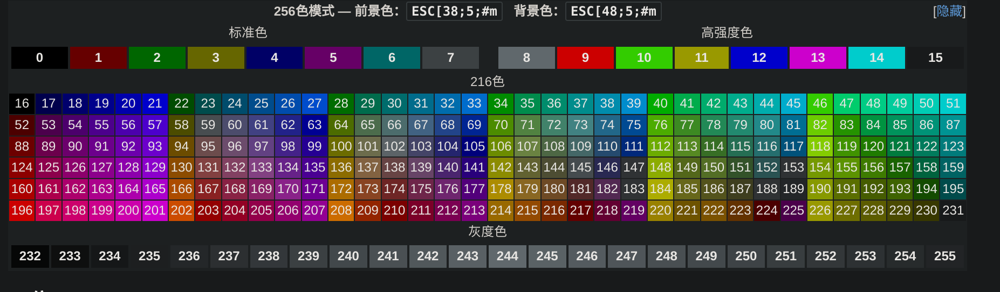

* 
* 以`\033[`开头作为转义码开头
    * 在实际使用中, 有可能开头使用`\0x1b[`, `\x1b[`, `\e[`
* 例
    * `\033[1;31m` -- 设置后面的文本为红色并加粗, `1`表示加粗, `31`代表红色, `m`代表开始应用于后面显示的文本
        * 参数和参数之间用`;`分割
        * 每个属性, 类似1和31的顺序可以乱放, 它们都属于同一个控制序列中的代码, 比如

* m 可以理解为是 modify 选项, 前面的1和31为具体的参数, m 选项可以修改字体的输出形式
## 可能常用的
* ESC 需要替换为 \x1b
### 控制位置
|ESC Code Sequence|Description|
|-|-|
|ESC[H| move cursor to home position (0, 0)|
|ESC[$line;$columnH| move cursor to $line, $column|
|ESC[2J| erase entire screen|

### 控制字体格式
|ESC Code Sequence|Reset Sequence|Description|
|-|-|-|
|ESC[0m|| reset all mode (style and colors)|
|ESC[1m|ESC[22m| set bold mode|
### 颜色 
|Color Name|Foreground Color Code|Background Color Code|
|-|-|-|
|Black| 30 | 40 |
|Red| 31 | 41 |
|Green| 32 | 42 |
|Yellow| 33 | 43 |
|Blue| 34 | 44 |
|Magenta| 35 | 45 |
|Cyan| 36 | 46 |
|White| 37 | 47 |
|Default| 39 | 49 |
|Reset| 0 | 0 |

* 38是字体颜色的256版本
    * 38的固定格式 "\x1b[38;5; ${id} m"
* 48是背景颜色的256版本
    * 48的固定格式 "\x1b[48;5; ${id} m"


### 常用隐私模式(直译)
|ESC Code Sequence| Description|
|-|-|
|ESC[?25l| make cursor invisible|
|ESC[?25h| make cursor visible|


```bash
echo "\033[1;31;3mhelloworld\033[0m"
# 使用1;31;3 这三个属性就是粗体, 红色, 斜体对应的控制码
```
