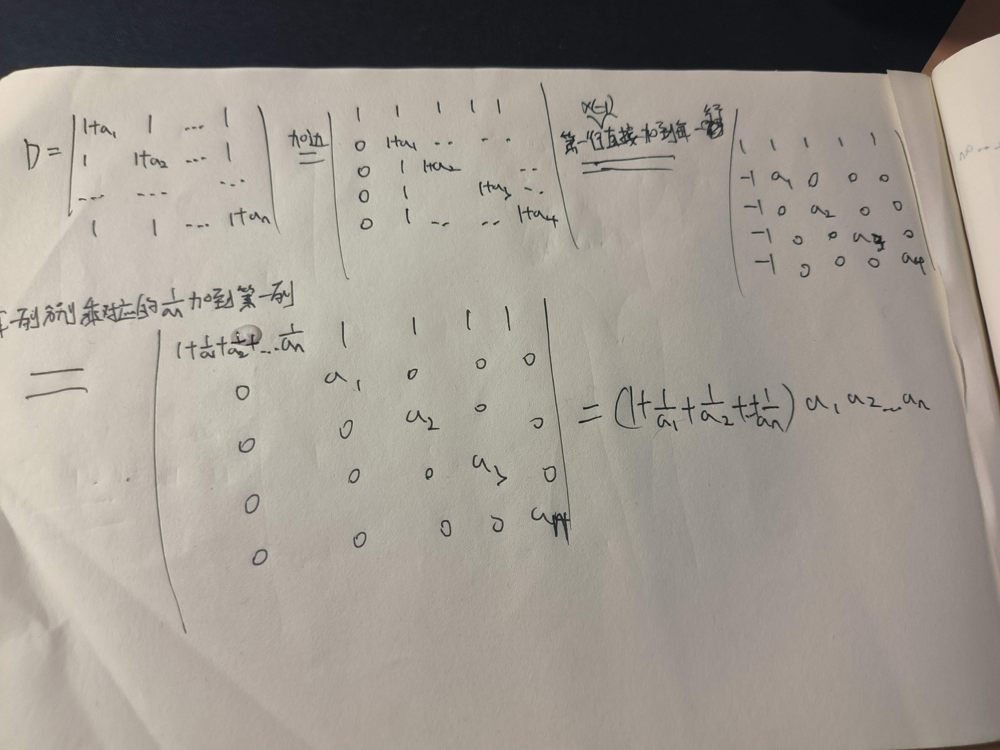
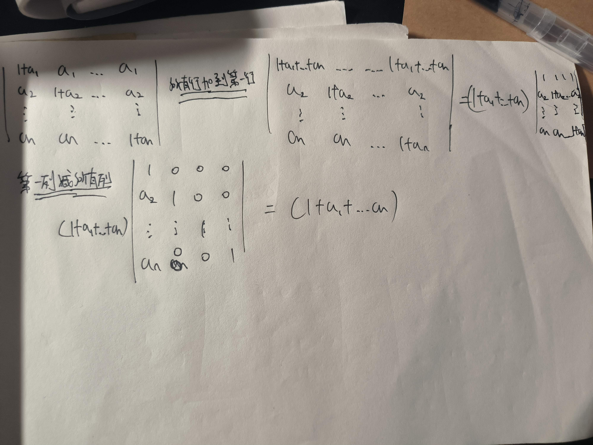

## 行列式 和 矩阵 对比
* 行列式拆分时一次只能拆一行

$\left| \begin{matrix}  
1 & 2 \\
a & b 
\end{matrix} \right|$
+
$\left| \begin{matrix}  
1 & 2 \\
x & y 
\end{matrix} \right| = $
$\left| \begin{matrix}  
1 & 2 \\
a+x & b+y 
\end{matrix} \right|$  

* 行列式提公因项只能提一行

2
$\left| \begin{matrix}  
1 & 2 \\
a & b 
\end{matrix} \right| = $
$\left| \begin{matrix}  
1 & 2 \\
2a & 2b 
\end{matrix} \right|$

* 矩阵加减作用于全部

$\left[ \begin{matrix}  
1 & 2 \\
a & b 
\end{matrix} \right]$
+
$\left[ \begin{matrix}  
1 & 2 \\
x & y 
\end{matrix} \right] = $
$\left[ \begin{matrix}  
2 & 4 \\
a+x & b+y 
\end{matrix} \right]$  

* 矩阵提公因式是全部提出来

2
$\left[ \begin{matrix}  
1 & 2 \\
a & b 
\end{matrix} \right] = $
$\left[ \begin{matrix}  
2 & 4 \\
2a & 2b 
\end{matrix} \right]$
## 解 四阶行列式
* 定理1: (按某行(列)展开)    
    * 行列式D = 任意列(行)元素与对应的`代数余子式`相乘的结果和  
    $D = a_{i1}A_{i1} + a_{i2}A_{i2} + ... + a_{in}A_{in}$
> $\left| \begin{matrix}  
> 1 & 4 & 3 & 7 \\
> 4 & 5 & 6 & 8 \\
> 7 & 8 & 9 & 2 \\
> 7 & 8 & 5 & 5
> \end{matrix} \right| $  
> =(按第一行展开) $1 * A_{11} + 4 * A_{12} + 3 * A_{13} + 7 * A_{14}$   
> A 为对应的 代数余子式  
## 特殊行列式
### 对角线为x, 其余皆为a
$ D = \left| \begin{matrix} 
x & a & ... & a \\
a & x & ... & a \\
... & ... & x & ... \\
a & a & ... & x
\end{matrix} \right| $ 

### 三叉型行列式
$ D = \left| \begin{matrix} 
1+a_1 & 1 & ... & 1 \\
1 & 1+a_2 & ... & 1 \\
... & ... &  & ... \\
1 & 1 & ... & 1+a_n
\end{matrix} \right| $   
* 需要使用`加边法`

#### 加边法
$ D = \left| \begin{matrix} 
1+a_1 & 1 & ... & 1 \\
1 & 1+a_2 & ... & 1 \\
... & ... &  & ... \\
1 & 1 & ... & 1+a_n
\end{matrix} \right| $   

$ = D_1 = \left| \begin{matrix} 
1 & 1 & 1 & ... & 1 \\
0 & 1+a_1 & 1 & ... & 1 \\
0 & 1 & 1+a_3 & 1 & 1\\
... & ... & ... & 1+a_4 & 1 \\
0 & 1 & 1 & ... & 1+a_n
\end{matrix} \right| $   
* 证明: 尝试将 D_1 使用第一行按行展开, 发现等于 D 这个四阶行列式 `(性质五: 推论: 某一行全为0, D = 0)`
### 对角线皆为 1+a_1
$ D = \left| \begin{matrix} 
1+a_1 & a_1 & ... & a_1 \\
1 & 1+a_2 & ... & 1 \\
... & ... &   & ... \\
1 & 1 & ... & 1+a_n 
\end{matrix} \right| $

## 加(减)法 -> 对应元素相加(减)
* 只有同型矩阵才能相加减    

## 矩阵乘法
* AB 之间有 `左乘`, `右乘`的区别
* 性质
    * $A_1A_2$ != $A_2A_1$

    * AB 有意义, BA 不一定有意义
    * AB = 0, 推不出 A = 0 或 B = 0
    * AB = AC, A != 0, 推不出 B = C
    * 0矩阵和任意矩阵相乘都为0
        * $A_{4*3} * 0_{3*2}$ = $0_{4*2}$ 
    * 和单位矩阵E相乘结果不变
        * AE = A, BE = B
    * $(A+B)C \ne CA + CB$
    * $C(A+B) = CA + CB$
        * 区别在`左乘`和`右乘`
    * A, B 可交换 = A, B同阶 
* 前提条件
    * $A_1$行数 = $A_2$列数    
* 方法
    * `左第一行`和`右第一列` 对应数先相乘再相加得到$A_{11}$ 
    * `左第一行`和`右第二列` 对应数先相乘再相加得到$A_{12}$
    * 类推得到所有数 ``

* 宋浩的七字口诀 = `中间相等取两边`
* 例: $A_{4*6} * A_{6*5}$
    * 因为 中间的 6 和 6 相等, 所以这两个矩阵可以相乘, 矩阵的大小是 4*5    
    

## 伴随矩阵($A^*$)
* 按行求, 按列放
* 记作 $A^*$

* 定理1: $AA^* = A^*A = |A|E$
* $|AA^*| = |A||A^*|$
* $|A^*| = |A^{n-1}|$

## 逆矩阵
* 必须是`方阵`

* `逆矩阵`: 矩阵A, 为n阶方阵, 存在n阶方阵B, 使AB = BA = E, 称A的逆矩阵为B, 也写作 $A^{-1} = B$
* 未必所有方阵均可逆 -> 0B = B0 = 0
* 若可逆, 逆矩阵唯一

* 定理: A 可逆的充要条件 $|A| \ne 0, A^{-1} = {{1} \over {|A|(A的行列式)}}A^*$

* 推论(常用): An为方阵, Bn为方阵, AB = E(BA = E), 则A可逆, $A^{-1} = B$
## 求逆矩阵的方法
### 伴随矩阵法(计算量很大)
$|A| \ne 0, A^{-1} = {{1} \over {|A|(A的行列式)}}A^*$
### 初等变换
* 行和列都成立
    * 交换两行 
    * $\left( \begin{matrix}  
    1 & 1 & 1 & 1 \\
    2 & 2 & 2 & 2 \\
    4 & 4 & 4 & 4  
\end{matrix} \right) -> \left( \begin{matrix}  
2 & 2 & 2 & 2 \\
1 & 1 & 1 & 1 \\
4 & 4 & 4 & 4  
\end{matrix} \right)$
    
    * 用k(k != 0)乘某一行 
    * $\left( \begin{matrix}  
1 & 1 & 1 & 1 \\
2 & 2 & 2 & 2 \\
4 & 4 & 4 & 4  
\end{matrix} \right) -> \left( \begin{matrix}  
6 & 6 & 6 & 6 \\
2 & 2 & 2 & 2 \\
4 & 4 & 4 & 4  
\end{matrix} \right)$
    * 某一行的x倍加到另一行上去 
    * $\left( \begin{matrix}  
1 & 1 & 1 & 1 \\
2 & 2 & 2 & 2 \\
4 & 4 & 4 & 4  
\end{matrix} \right) -> \left( \begin{matrix}  
1 & 1 & 1 & 1 \\
2 & 2 & 2 & 2 \\
0 & 0 & 0 & 0  
\end{matrix} \right)$
### 初等变换法
* 式子和式子之间用 -> 连接
* 例. 求 $\left( \begin{matrix}  
    1 & 0 & 1 \\
    2 & 1 & 0 \\
    -3 & 2 & -5  
    \end{matrix} \right)$ 的逆矩阵
> * `第一步`: 将矩阵A写成下面的格式(在第一步和最后一步要画虚线) 
>   * (A, E) = $\left( \begin{matrix}  
    1 & 0 & 1 & . & 1 & 0 & 0\\
    2 & 1 & 0 & . & 0 & 1 & 0\\
  -3 & 2 & -5 & . & 0 & 0 & 1 
    \end{matrix} \right)$  
> * `目的`: 将矩阵(A, E)转化为下面的格式  
>   * $\left( \begin{matrix}  
    1 &  &  & . & & &\\
     & 1 &  & . & & &\\
     &  & 1 & . & & & 
    \end{matrix} \right)$  
> * `右边剩的就是$A^{-1}$`
> * `技巧`
>   * 先弄第1列, 再1列1列往后弄
>   * 先尝试着做, 如果怎么都化不出1, 那就是不可逆
>   * 只对`行`进行操作
> * 验证结果的方法
>       * 使用$A^{-1} * A $观察是否等于 E