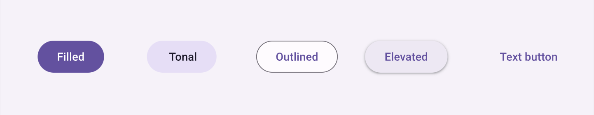

## Activity Life Cycle
```Activity Life Cycle
                               ╔════════════╗
                               ║  Activity  ║
                               ║  launched  ║
                               ╚════════════╝ 
                                      |    
                                      ⌄    
                               *------------*
             ╭ ------------->  | onCreate() |
             |                 *------------*
             |                        |    
             |                        ⌄    
             |                 *------------*                    *------------*
             |                 |  onStart() |  <---------------- | onRestart()|
             |                 *------------*                    *------------*
             |                        |     means app in foreground    |
                                      ⌄    /                           |
       User navigates          *------------*                          |
       to the activity         | onResume() |  <------------╮          |
                               *------------*               |          |
             |                        |                     |          |
             |                        ⌄                     |          |
        ╔════════════╗         ╔════════════╗               |          |
        ║ App process║         ║  Activity  ║               |          |
        ║    killed  ║         ║  running   ║               |          |
        ╚════════════╝         ╚════════════╝               |          |
             ^                        |                     |          |
             |                        ⌄                     |          |
             |                Another activity comes        |          |
             |                into the foreground           |          |
             |                        |                     |          |
             |                        ⌄                     |          |
     Apps with higher          *------------*               |          |
  priority need momory         |  onPause() |  ------  User returns    |
             |                 *------------*         to the activity  |
             |                        |                                |
             |                        |                                |
             |                   The activity is                       |
             |                  no longer visible                      |
             |                        |                                |
             |                        ⌄                                |
             |                 *------------*                          |
             ╰--------------   |  onStop()  |   ---------------- User navigates   
                               *------------*                    to the activity
                                      |    
                        The activity is finishing or
                        being destoryed by the system
                                      |
                               *------------*
                               | onDestory()|
                               *------------*
                                      |
                                ╔════════════╗
                                ║ Activity   ║
                                ║ shut down  ║
                                ╚════════════╝
```
##   
## Divider
* `Divider` 是一个用于在界面中创建视觉分隔线的组件
* `Divider` 被改用为了 `VerticalDivider` 和 `HorizontalDivider`
* 直接使用 VerticalDivider() 和 HorizontalDivider() 即可, 需要改变样式使用 modifier
## Surface 
* 主要用于为其他 UI 元素提供背景、边框、阴影等视觉效果
```kotlin
Surface(
    //... 
)
## Spacer
* `Spacer` 用于在 UI 元素之间创建空白区域, 在布局中起到占位符的作用
```kotlin
Spacer(
    modifier = Modifier.width(16.dp)
    modifier = Modifier.height(16.dp)
)
```
## remember
* `remember` 是 jetpack compose 中的一个函数，用来告诉 compose 在 ui 重组时（当状态发生变化时）保留某个值。它用于保存局部状态，确保当 compose 重新构建界面时，这个值不会丢失

* jetpack compose 是一个声明式 ui 框架，这意味着 ui 组件会根据当前状态来重新绘制界面。当某些状态发生变化时，compose 可能会重新运行某些代码块。如果你在这些代码块中没有通过 remember 保存状态，重新运行时这些值可能会重置为初始值。

* 例如，如果没有 remember，在重组时每次 mutablestateof 都会重新初始化为其默认值，导致状态的丢失
```kotlin
@composable
fun counter() {
    // 使用 remember 保存一个计数状态
    var count by remember { mutablestateof(0) }

    column {
        text(text = "count: $count")

        button(onclick = { count++ }) {
            text("increment")
        }
    }
}
```
* 在 Jetpack Compose 中, State 是一种数据模型, 用于驱动界面显示. 每当 `State` 发生变化, Jetpack Compose 会自动重新构建使用该 State 的 UI 部分
## TextField
`TextField` 允许用户输入文本，并可以与其他 UI 元素交互. 它通常与 mutableStateOf 结合使用来管理和保存用户输入的状态
### OutlinedTextField
* `OutlinedTextField` 功能与 `TextField` 类似, 与 `TextField` 的区别是带有带边框的外观
```kotlin
OutlinedTextField(
    value = name,
    // value: String
    // 输入框当前的文本值. 应与可变状态绑定

    onValueChange = {},
    // onValueChange: (String) -> Unit 
    // 当用户输入文本时触发的回调, 用于更新文本值
    // 用例
    onValueChange = {text -> name = text},
    // onValueChange 为lambda函数, 传入 text 参数, text 为用户每次输入的值, 函数体为 {name = text}
    // 每次用户输入都更新当前文本值

    label = { Text("type something") },
    // label: @Composable() -> Unit
    // 输入框顶部的标签, 用于指示用户应输入什么内容

    placeholder = { Text("hello") },
    // placeholder: @Composable() -> Unit 
    // 输入框为空时显示的占位符文本，提示用户输入

    // `label` 和 `placeholder` 的区别, `label` 在输入时提示符会飘到输入框上方, `placeholder` 不会

    leadingIcon = {Icon(Icons.default.Call), contentDescription = "null"}, 
    // leadingIcon: @Composable() -> Unit
    // 输入框左侧的图标, 可用于增强输入框的视觉效果

    trailingIcon = {Icon(Icons.default.Call), contentDescription = "null"}, 
    // trailingIcon: @Composable() -> Unit
    // 输入框右侧的图标，用于显示额外的信息或操作

    isError = true,
    // isError: Boolean
    // 如果为 true, 输入框会使用错误样式

    singleLine = true,
    // singleLine: Boolean
    // 控制输入框是否只允许输入单行文本. 如果为 true, 输入框将限制为单行

    modifier = Modifier, 

    visualTransformation, 
    // visualTransformation: VisualTransformation
    // 用于修改文本的显示方式, 如密码输入时将文本隐藏
    // 并没有研究 

    keyboardOptions,
    // keyboardOptions: KeyboardOptions
    // 用于配置软键盘的行为, 如输入类型(文本、数字等)和操作(完成、下一步等) 
) {

}
```
### BasicTextField
* `BasicTextField` 是用于文本输入的组件, TextField 更底层的实现. 它允许开发者进行更细致的自定义, 比如自定义绘制或输入行为.
## State
### mutableStateOf()
* mutableStateOf() 是创建 `State` 的常用方法
* mutableStateOf() 返回一个包含可变值的 `State` 对象，并且这个对象能够在 UI 中进行自动跟踪和观察

* 在 Jetpack Compose 中, UI 是声明式的, 即 UI 会根据数据状态来进行自动更新. 而 mutableStateOf() 可以帮助你将可变的数据封装为一个可以被 Compose 跟踪的状态对象, 使得当状态改变时, Compose 界面会自动响应并重组
## modifier
```kotlin
Text(
    text = "Hello, Jetpack Compose!",
    modifier = Modifier
        .background(Color.Blue)
        .padding(16.dp)
        .background(Color.Green)
        // 由于链式调用, 会生成 Blue 外边框, Green 内框的图形
)
```
```kotlin
Modifier.fillMaxSize()
Modifier.fillMaxWidth()
Modifier.fillMaxHeight()

Modifier.align(Alignment.Center)
// Alignment.Center：居中对齐
// Alignment.TopStart：左上角对齐
// Alignment.TopEnd：右上角对齐
// Alignment.BottomStart：左下角对齐
// Alignment.BottomEnd：右下角对齐
// Alignment.TopCenter：顶部居中
// Alignment.BottomCenter：底部居中
// Alignment.CenterStart：垂直居中，左对齐
// Alignment.CenterEnd：垂直居中，右对齐

Modifier.padding(16.dp)

Modifier.size(100.dp, 50.dp)

Modifier.wrapContentSize()
// not work at all, try to figure out what it is

Modifier.background(Color.Blue)

Modifier.border(2.dp, Color.Red)

Modifier.shadow(4.dp)

Modifier.clickable { /* some action */ }

Modifier.draggable(/* what kind of stuff inside? */)

Modifier.weight(2f)
// 定义组件在布局中的比例, 例如我有 1f 的组件和 2f 的组件, 它们的比例为 2:1
// 使用 weight 不会影响那些已经定义了固定高度或宽度的组件，它们会按原有大小显示，剩余的空间再分配给其他组件
```
## Text
### attribute
* text = String,
* modifier = Modifier,
* color = Color.$color,
* fontSize = 20.sp,
### BasicText
* `BasicText` 是一个用于显示静态文本的组件, 主要用于文本内容的展示. 与 `Text` 类似, 但它不提供许多高级功能, 如样式或富文本支持
## Layout
### Column
* 使 {} 中的子组件呈上下排列
#### attribute 
* modifier = Modifier  
* horizonalAlignment
* verticalArrangement 
### Row
* 使 {} 中的子组件呈左右排列
#### attribute 
* modifier = Modifier  
* horizontalArrangement
* verticalAlignment  
## Box
* `Box` 允许将多个子组件放置在同一位置, 子组件的排列顺序按照它们的添加顺序决定
* 可以在 `子组件` 的属性中指定modifier 来修改位置
### attribute 
* contentAlignment = Alignment.`Center`
    * 指定子组件默认的排列位置 
## Image
* 通过设置 `painter` 和 `contentDescription` 来设置图像资源和描述

* painter：用于加载和渲染图像的资源，通常使用 painterResource 来获取 drawable 资源
    * painter = painterResource(id = R.drawable.your_image)
* contentDescription：用于无障碍功能，提供图像的描述，有助于视障用户理解图像内容
### attribute 
* `contentScale` 来控制图像的缩放方式
    * contentScale = ContentScale.Crop: 裁剪图像, 保持宽高比
    * contentScale = ContentScale.Fit: 适应图像, 保持宽高比
    * contentScale = ContentScale.FillBounds: 填充整个区域, 不保持宽高比
    * contentScale = ContentScale.Inside: 保持宽高比, 图像尽量适应到容器内
## LazyColumn 和 LazyRow
* `LazyColumn` 和 `LazyRow` 是一个高效的垂直列表组件, 专门用于显示大量数据时的懒加载
* 与传统的 Column 不同, LazyColumn 只会渲染当前可见的项目, 而不是一次性渲染所有项目, 因此性能更好

* 使用 `item` 和 `items` 来包含项目
```kotlin
LazyColumn {
    item {
        Text("Header")
    }
    items(listOf("Apple", "Banana", "Cherry")) { fruit ->
        Text("Fruit: $fruit")
    }
    item {
        Text("Footer")
    }
}
```
### items
* `items` 接受两个主要参数
* 数据源: 一个可迭代的集合(如列表, 数组等)
* itemContent: 一个可组合函数, 用于定义如何渲染每个列表项
```kotlin
LazyColumn {
    items(names) { name ->
        Text(text = name)
    }
}
```
* `itemsIndexed` 可以获取当前项的索引
```kotlin
LazyColumn {
    itemsIndexed(names) { index, name ->
        Text(text = "$index: $name")
    }
}
```
## Button
### 样式
* 实心按钮: Button(){}
* 填充色调按钮: FilledTonalButton(){}
* 轮廓按钮: OutlinedButton(){}
* 凸起按钮: ElevatedButton(){}
* 文本按钮: TextButton(){}


### api
```kotlin
Button (
    onClick = {},
    // onClick: () -> Unit
    // 点击按钮时触发的回调函数。按钮的主要功能就是通过这个属性定义用户的交互行为

    enabled = false,
    // enabled: Boolean
    // 指示按钮是否可用. 如果为 false, 按钮将被禁用, 并且无法被点击

    modifier = Modifier, 

    colors = ButtonColors
    // ?

    shape = Shape
    // ?

    elevation = ButtonElevation
    // ?

    interactionSource = MutableInteractionSource
    // ?

    contentPadding = PaddingValues
    // ?
)
```


