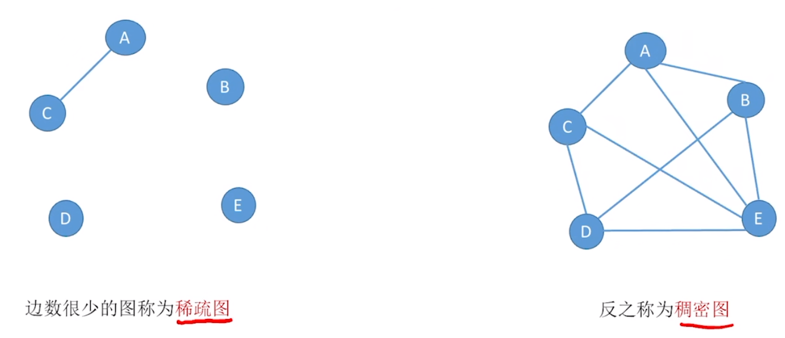
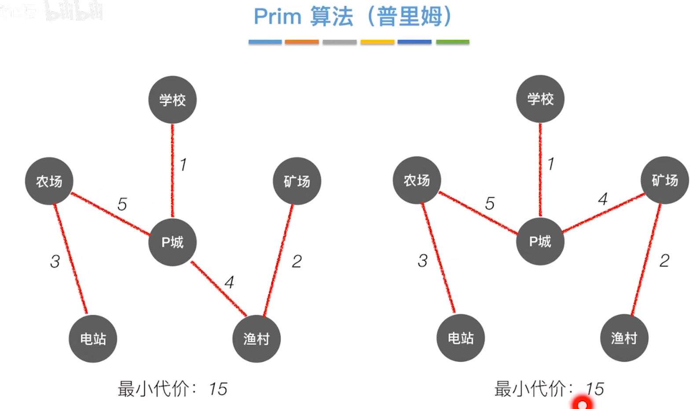

### 线性表
[->从2.1开始的<-](https://www.bilibili.com/video/BV1b7411N798)
### 二叉树
* 常考性质
    1. i的左孩子 = 2i
    2. i的右孩子 = 2i+1
    3. i的父节点 = i/2
    4. i的所在层次 = $log_2(n+1)$ 或 $log_2n + 1$
* 深度和高度
    * 树的高度：从所有叶节点开始数高度到根节点，其中的最大值；也就是从结点x向下到某个叶结点最长简单路径中边的条数。

    * 树的深度：树根下中所有分支结点层数的最大值，递归定义。（一般以根节点深度层数为0）

    * 可以看出两个概念定义是相互反向的，就跟我们数高楼从下往上，地下室深度从上往下，这里树本来跟现实中的树就是相反的，所以高度深度计算的方法也是相反。
#### 完全二叉树
* 只有最后一层可以不满

* 每个节点尽量往左边靠

* 叶子节点是所有最下面的节点

* 绿色为`叶子节点`

* 若完全二叉树中共有n个结点，则  
    1. 判断i是否有左孩子? -> 2i <= n?
    1. 判断i是否有右孩子? -> 2i+1 <= n?
    2. 判断i是否是叶子/分支结点? -> i>(n/2)
#### 二叉排序树
* `左子树`上所有结点的`关键字`均`小于根节点`的关键字

* `右子树`上所有结点的`关键字`均`大于根节点`的关键字

* 左子树和右子树又各是一棵二叉排序树
#### 平衡二叉树
* 平衡二叉树：树上任一结点的左子树和右子树的深度差不超过1
#### 顺序存储

> 结论:二叉树的顺序存储结构，只适合存储完全二叉树
#### 链式存储
```cpp
typedef struct BiTNode
{
    ElemType data;  //数据域
    struct BiTNode *lchild, *rchild;    //左右孩子指针
}
```
#### 遍历
* 先序遍历：根->左->右
* 中序遍历：左->根->右
* 后序遍历：左->右->根
### 图
* 线性表可以是空表,树可以是空树,但是`图不可以为空`

* 在图中有`边`,边分为`有向边`(也称`弧`)和`无向边`(简称`边`)

* n个顶点的图，若顶点 > n-1,则一定有回路
#### 简单图，多重图
* 简单图：
    1. 不存在重复边(`有向图的相反方向的边不算是重复边`)
    2. 不存在顶点到自身的边
* 多重图
    * 和简单图相反
#### 顶点的度，入度，出度
* 对于`无向图`, 顶点v的度是指`依附于该顶点的边的条数`

* 对于`有向图`, `入度`是以顶点v为终点的有向边的数目

* 对于`有向图`, `出度`是以顶点v为起点的有向边的数目

* 对于`有向图`, `顶点v的度` = 入度数量 + 出度数量
#### 顶点，回路，简单路径，简单回路
* 路径: 顶点a到顶点d之间的一条路径是指顶点序列,a, b, c, d
* 回路: 第一个顶点和最后一个顶点相同的路径称为回路或环
* `简单路径`: 顶点`不重复出现`的路径称为简单路径
* `简单回路`: 除第一个顶点和最后一个顶点外,其余顶点不重复出现的回路称为简单回路
* 点到点的距离: 从顶点u出发到顶点v的最短路径,如果从u到v不存在路径，则该路径为无穷($\infin$)

* `无向图`中，若从顶点v到顶点w有路径存在,则称v和w是`连通`的 
* `有向图`中,若从顶点v到顶点w和从从顶点w到顶点v都有路径,则称这两个顶点是`强连通`的
#### 连通图,强连通图

#### 子图

* 子图要有点和边都相等

* 生成子图是指只要有其中的点就能算生成子图
#### 连通分量和强连通分量
##### 连通分量
* 专指`无向图`

* `无相图`中的`极大连通子图`称为`连通分量`


* 连通分量之间一定要极大，即切出来的连通分量不和其他连通分量相连
##### 强连通分量

* 因为不存在从F到其他点的路径，所有F不能算作是强连通分量中的一个顶点，只能`单独算作一个`
#### 生成树
* 无向连通图的生成树是包含图中全部顶点的一个极小连通子图

* 生成树可能有多个

* 若图的顶点数为n,则它的生成树含有n-1个边

* 若砍去它的一条边,则会变成非联通图,若加上一条边则会形成一个回路

#### 生成森林

#### 几种特殊形态的图




* 树: 不存在回路,且连通的无向图 -> n个顶点的树，必有n-1条边
* 有向树: 一个顶点的入度为0,其余顶点的入度均为1的有向图
#### 图的储存
##### 邻接矩阵法

* 空间复杂度 = O($N^2$)

* 适合储存稠密图
##### 邻接表法

> 如何看这张图
蓝色的无向图部分,A后的链表,1表示A与索引为1的data相连,2表示A与索引为2的data相连
##### 十字链表 -> 存储有向图

>如何看这张图
* 从A头的橙色指针出发可以找到所有A的入度,从A头的绿色指针出发可以找到所有A的出度

* 同一个节点可以被多个橙色或绿色指针指向

* 空间复杂度: O(边 + 顶点)

* 如何找到指定顶点的所有`入边` -> 顺着`橙色`线路找

* 如何找到指定顶点的所有`出边` -> 顺着`绿色`线路找

* 十字链表只能用于存储有向图
##### 邻接多重表 -> 无向图

>如何看这张图
>* 和十字链表法类似，每个顶点后的指针指向弧节点，弧节点中存储有指向信息
>
>* 不同颜色的信息对应的是不同顶点的信息

* 空间复杂度: O(边 + 顶点)
#### 图的基础操作
##### Adjacent(G, x, y): 判断图G中是否存在边<x, y>或(x, y)
* <>表示有向图
* ()表示无向图


>* 如果是邻接矩阵,根据表查看(x, y)对应的值`是不是1`即可
>
>时间复杂度: O(1)
>
>* 如果是邻接表, 需要`遍历A数据后的节点`, 如果出现对应数据则为存在
>
>时间复杂度: O(1)~O(边数)

* 这张图`有向图`和`无向图`通用
##### Neighbors(G, x): 列出图G中与节点x邻接的边
* 邻接矩阵和邻接表的示意图都参考上面Adjacent中的图

* `有向图`和`无向图`同理

> 如果是`邻接矩阵`
> * 查找横轴或者竖轴, 数字为1的即为邻接, 
>
>时间复杂度 = O(边数)  
>
>如果是`邻接表`
>* 顺着data后的指针读下去, 都是与x想接的边
>
>无向图的`时间复杂度`: O(1)~O(边数)
>
>有向图的`时间复杂度`: 
>   * 出边: O(1)~O(边数)
>   * 入边: O(顶点数)
##### InsertVertex(G, x): 在图G中插入顶点x

##### DeleteVertex(G, x): 从图G中删除顶点x
* `有向图`和`无向图`通用
> 如果是邻接矩阵
>
>可以设置一个标记位, 来记录节点有没有被删除
>
>时间复杂度: O(边数)

>如果是邻接表
>
>每次需要删除对应的链表信息, 再拼接起链表
>
>时间复杂度: O(1)~O(边数)
##### AddEdge(G, x, y): 若无向边或有向边不存在, 则向图G中添加该边
>如果是邻接矩阵  
>
>将对应项(x, y)的值改为1即可
>
>时间复杂度: O(1)

>如果是邻接表
>
>将对应关系的节点添加到对应的data项后(这是一种更省时间的做法)
>
>时间复杂度: O(1)
##### RemoveEdge(G, x, y): 若无向边或有向边存在, 则向图G中删除该边
* 和AddEdge方法类似
##### FirstNeighbor(G, x): 求图G中顶点x的第一个邻接点, 如果有则返回顶点号, 如果没有则返回-1 
> 如果是邻接矩阵
>
>依次查找表中对应的节点, 如果值为1则返回顶点号
>
>* 时间复杂度: O(1)~O(定点数)

> 如果是邻接表
>
>直接返回data项后的第一个指针对应的顶点号
>
>* 时间复杂度: O(1)

* 有向图的情况类似, 但是时间复杂度不同
> 如果是邻接矩阵
> 
>* 时间复杂度: O(1)~O(定点数)

> 如果是邻接表
>
>* 找`出边`邻接点: O(10)
##### NextNeighbor(G, x, y): 
* x, y是邻接点, 函数会返回x除y以外的另一个邻接点

* 如果是邻接矩阵
>不断遍历矩阵中的一行, 只到找到邻接点的顶点号, 若没找到则返回-1
>
> 时间复杂度: O(1)~O(顶点数)
* 如果是邻接表
> 直接顺着data后的指针找对应的邻接点就可以
>
>时间复杂度: O(1)
#### 图的遍历
* BFS 和 DFS 这俩好像 
##### 广度优先遍历 BFS
`BFS` -> `Breadth First Search` -> `广度优先遍历`
* 忘了就看视频
[6.3_1](https://www.bilibili.com/video/BV1b7411N798)
##### 深度优先遍历 DFS
* 忘了就看视频
[6.3_2](https://www.bilibili.com/video/BV1b7411N798)
##### BFS 和 DFS 的区别
一、深度优先搜索(dfs)

① 概念理解：一个人迷路，遇到很多分叉路口，他只有一个人，并且想走出去，所以只能一个个尝试，一条道路走到黑，发现到头了，然后再拐回去走刚才这条路的其他分叉路口，最后发现这条路的所有分叉路口走完了，选择另外一条路继续以上操作，直到所有的路都走过了。实际上就是往深度走，走错了就回来，找没走过的路，直到走到终点。

② 实现方式：堆栈实现，

③ 优点：能找出所有解决方案；相对于bfs内存占用少。

④ 缺点：找到的路径有可能不是最短路径，且在深度较大时效率低。

二、广度优先搜索(bfs)

① 概念理解：一个人迷路，但是他有技能（分身术）它遇到分叉路口，不是选一个走，而是分身多个人都试试，比如有A、B、C三个分叉路口，它A路走一步，紧接着B路也走一步，然后C路也赶紧走一步，步伐整齐统一，直到所有的路走过了。实际上就是往四周搜索，分开搜索。
#### 最小生成树-Prim算法, Kruskal算法
##### Prim算法(普里姆)

> 从某一个顶点开始构建生成树;  
> 每次将`代价最小的新顶点`纳入生成树, 直到所有顶点都纳入位置
* 同一个图可能有多个最小生成树

* 每次选择顶点时是用已经选择的整体顶点来寻找周围代价最小的顶点

* 时间复杂度: O(顶点数^2)

* 适合于边稠密图
* 原因: 边稠密时一次性排除的备选边更多

* 类似动态规划

##### Kruskal(克鲁斯卡尔)
* 不关心连接边时是否能使边相连, 直接选取权最小的边

* 时间复杂度: O($边数log_2边数$)

* 适合用于边稀疏图
* 原因: 在边稀疏时表现比Prim算法更好  
~~(其实是我还没去查原因)~~


### 查找
* 查找长度: 在查找运算中, 需要对比关键字的次数称为查找长度

* 平均查找长度: (ASL, Average Search Lengh) -- 所有查找过程中进行关键字的比较次数的平均值

* 有的实现方法会有"`哨兵位`", 即使用数组的`0号位`来存放`临时数据`
#### 顺序查找
* 又叫`线性查找`, 通常用于线性表

* 算法思想: 从头到尾挨个找(反过来也可以)

* `平均查找长度`: 
    * 查找成功: (n+1)/2
    * 查找失败: n+1 

* 最好时间复杂度: O(1)
* 最坏时间复杂度: O(n)
* 平均时间复杂度: O(n)
#### 折半查找
写之前这玩意我就懂得差不多了, 忘了去看b站收藏[二分查找为什么总是写错？](https://www.bilibili.com/video/BV1d54y1q7k7)

* 仅适用于`有序`的`顺序表`
* 链表不能实现折半查找

* 时间复杂度: $log_2n$
##### 查找效率分析
* 考研才会考, 以后再补上
#### 分块查找
* 具体是什么

* 块间有序, 块间无序  

* 类似操作系统中二级页表查找的概念, 能加快查找速度
#### 哈希查找
* 又叫散列查找, 特点是: 数据元素的关键字与其存储地址直接相关

* 若`不同的关键字`通过`哈希函数`, 映射到同一个值, 则称它们为`同义词`

* 最理想情况下查找时间复杂度可以是O(1)

* 通过哈希函数`确定的位置`已经`存放了其他元素`, 则称这种情况为`冲突`

> 装填因子$\alpha$ = 表中记录数 / 散列表长度
>* 装填因子越大说明列表装填得越满
>* 装填因子会直接影响哈希表得查找效率
>* 装填得越满, 发生冲突得可能越大
##### 处理冲突的方法--拉链法
* 用拉链法(又称链接法, 链地址法)处理冲突: `把所有同义词存储在一个链表中`

* 查找长度: 在查找运算中, 需要对比关键字的次数称为查找长度
>例：
>在哈希值为1的地址有链表14 -> 1 -> 27 -> 79  
>如果要查找27, 则查找长度为3(14 -> 1 -> 27(3个元素))  
>
>如果哈希值对应的链表内容为空, 则查找次数为0

* ASL计算方法: 得去查一下, 打字说不明白
##### 哈希函数的设计方法
* 除留余数法 -- H(key) = key % p
> 若散列表长为m, 取一个不大于m但最接近或等于m的质数p
>* 为什么是质数 -- 用质数取模, 分布更均匀, 冲突更少

* 直接定址法 -- H(key) = key 或 H(key) = a*key + b
>   * 其中a和b是常数。这种方法计算最简单, 且不会产生冲突, `适合关键字的分布基本连续的情况`
>//下面的还没看完, 记得看完
>
>
### 排序
* 算法的稳定性
    * 稳定的: 关键字相同的元素在排序之后相对位置不变
    * 不稳定的: 与上面相反, 排序后相同元素位置改变

* 排序算法的分类
    * 内部排序 -- 数据一次可以都加载到内存
    * 外部排序 -- 数据太多, 无法全部放入内存

* 不稳定的算法
    * 选择排序
    * 快速排序
    * 希尔排序
    * 堆排序
* 稳定的算法
    * 冒泡排序
    * 插入排序
    * 归并排序
    * 基数排序
#### 插入排序
* 算法思想: 每次将一个待排序的记录按其关键字大小插入到已排好序的子序列中, 直到全部记录插入完成

* 复杂度
    * 空间复杂度: O(1)
    * 时间复杂度: O(n)

    * 最好时间复杂度: O(n)
    * 最坏时间复杂度: O(n^2)
    * 平均时间复杂度: O(n^2)
* 稳定性: 稳定

* 最好情况下的比较次数: n-1
* 最坏情况下的比较次数: n(n-1)/2
##### 优化 -- 折半插入排序
感觉知道有这么个方法就行, 具体等考到了再总结