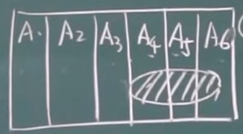
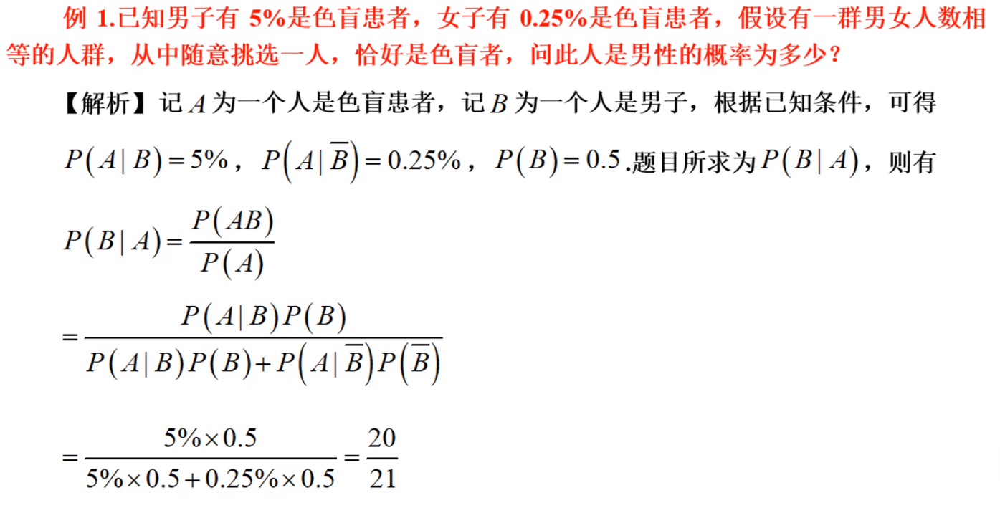
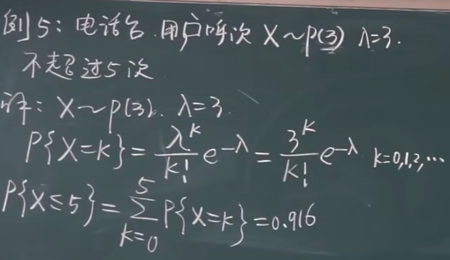
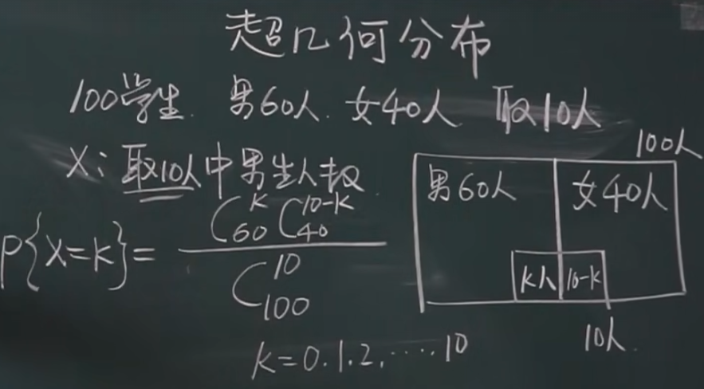
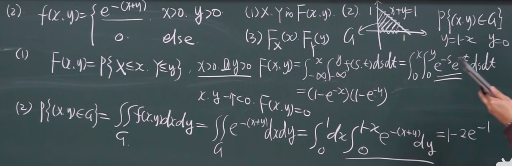
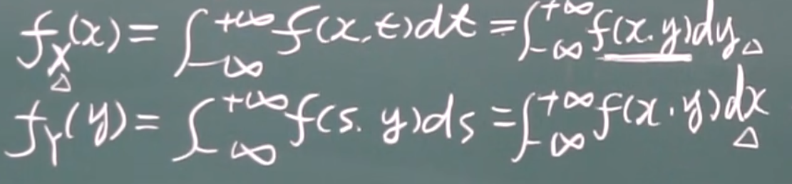
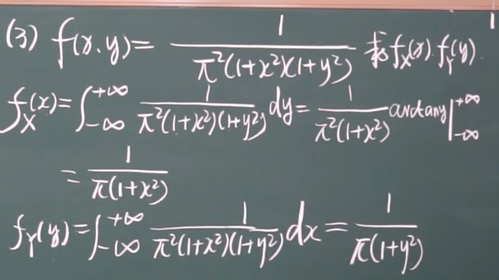

# 大题
## 全概率公式
设$A_1, A_2......A_n$为完备事件组, $B$为事件组中的任意事件, 求$B$发生的概率  

公式 = $P(B|A_1) + (B|A_2)..... + (B|A_n)$  
就是求每个事件内B发生的概率, 求完后加起来就行

## 贝叶斯公式
设$A_1, A_2......A_n$为完备事件组, $A_i$为其中一个事件, $B$为任意事件, 求在$B$发生的前提下为$A_i$的概率

公式 = $P(A_i) * P(B|A_i) \over P(B)$

记得按照公式做题

# 小题
## 各种分布
密度函数 -- f(x) -- y表示每个x坐标上的概率  
分布函数 -- F(x) -- y表示每个x坐标之前的概率总和
### 离散分布
#### 0-1分布
x只能取`0`或`1`
|x|1|0|
|-|-|-|
|P|P|1-P|
##### 期望和方差
$EX = p, E(X^2) = p$  

$DX = E(X^2) - E^2(X) = p(1-p)$
#### 几何分布
P(A) = p, 前k-1次未发生事件, 在第k次首次发生  
>
>$P{x = k} = (1-P)^{k-1}P$   
表示为`X ~ G(P)`  
G -> geometry
##### 期望和方差
$EX = {1 \over p}$  
$DX = {{1-p} \over p^2}$
#### 二项分布
P(A) = p, n次实验, 发生了k次
>$P\{x=k\} = C^k_np^k(1-p)^{n-k}, k=1, 2, ..., n$
>表示为`X ~ B(n, p)`  
B -> binary 
##### 期望和方差
$EX = np$  
$DX = np(1-p)$
#### 泊松分布
$P\{x = k\} =$ ${\lambda^k} \over {k!}$ $e^{-\lambda}$  
$k = 0, 1, 2, 3, ....$  
>表示为`X ~ P(\lambda)`  
可能的例题: 电台的呼叫次数, 公用设施(等车, 收银台)

二项分布可以转化为泊松分布来计算  
n = 总数  
p = 概率  
$\lambda = n*p$  
然后直接查k的值来求和就行
##### 期望和方差
$EX = \lambda$  
$DX = \lambda$
#### 超几何分布

一般来说不好算，可以转换为二项分布，如果还不好算就转换为泊松分布
### 连续分布
#### 均匀分布
$ f(x) = \begin{cases}
1 \over {b-a} & a \le x \le b \\
0             & else
\end{cases}
$  

>表示为`X ~ U(a, b)`  
U表示uniform

转换为`分布函数`得  
$ F(x) = \begin{cases}
0                   &   x\le a          \\
{x-a} \over {b-a}   &   a\le x \le b    \\
1                   &   b\ge x
\end{cases}
$
##### 期望和方差    
$EX = {a+b \over 2}$  
$DX = {{(b-a)}^2 \over 12}$
#### 指数分布
$ F(x) = \begin{cases}
\lambda e^{-\lambda x}   &   x > 0    \\
0                        &  x\le 0    \\
\end{cases}
$  
>表示为X~Exp($\lambda$)

转换为`分布函数`得  

$ f(x) = \begin{cases}
1- e^{-\lambda x}        &   x > 0    \\
0                        &  x\le 0    \\
\end{cases}
$
##### 期望和方差    
$EX = {1 \over \lambda}$  
$DX = {1 \over \lambda^2}$
#### 正态分布
做题思路一般是先将一般正态分布转换为标准正态分布再做题
##### 期望和方差    
$EX = \mu$  

$DX = \sigma^2$ 
##### 一般正态分布
公式几乎不用记  
>表示为$X $ ~ $N(\mu, \sigma^2)$    
知道$\mu$和$\sigma^2$就能做题  
注意括号里是$\sigma^2$

* 性质
    1. $y=\phi(x)$以x=$\mu$为对称轴, $f(\mu)$ = $1 \over \sqrt{2\pi} \sigma$

    2. $\sigma$固定, $\mu$变化,左右移动  
       $\mu$固定, $\sigma$变化  
       * $\mu$变小, 最高点上移, 图像变细长
       * $\mu$变大, 最高点下移, 图像变粗短
##### 标准正态分布
当$\mu = 0$, $\sigma = 1$就叫做标准正态分布

在标准正态分布中使用$\phi_0(x)$和$\Phi_0(x)$来表示标准, 在一般正态分布中没有下标0  

公式一:  $\Phi(-x)$ = $1 - \Phi(x)$  

一般正态分布转换为标准正态分布的公式
公式二: $\Phi(x) = \Phi_0({{x-\mu} \over \sigma})$
>从一般正态分布转换到标准正态分布的例题  
>给X~N(1, 4), 求 P{0<x<1.6}
>
>解: P{0<x<1.6} = $\Phi(1.6)-\Phi(0)$  
>
>由公式二得 $\Phi_0(0.3)-\Phi_0(-0.5)$  
>
>再由公式一得 $\Phi_0(0.3)-1+\Phi_0(0.5)$
## 一维随机变量
### 离散型
很简单
### 连续型
#### 例题一
有$X$~$N(0, 1)$, $Y=x ^2$, 求$F_Y(x)$  
>解:  
>当x < 0时, $F_Y(x) = P\{Y \le x\} = P\{x^2 \le x\} = 0$   
>
>当x > 0时, $F_Y(x) = P\{Y \le x\} = P\{x^2 \le x\} = P\{-\sqrt x \le x \le \sqrt x\}$
> 后面不会了
### 数字特征
#### 数学期望(平均值)
> 离散型:  
$E(x) = \stackrel{\infin}{\sum\limits_{i=1}} x_ip_i$

>连续型:  
$E(x) = \int^{\infin}_{-\infin}xf(x)dx$

>例题  
$f(x) = {1 \over 2}, 0 \le x \le 2, Y = 4x + 1$ 求 E(Y)  
>
>E(Y) = E(4x+1) = $\int^\infin_{-\infin}(4x+1)f(x)dx = \int^\infin_{-\infin}{1 \over 2}(4x+1)dx$= ... (算出答案) 
#### 方差
$D(x)$
## 二维随机变量
### 联合分布
$F(x, y) = P\{X \le x, Y\le y\}$
### 边缘分布
纯粹是个人理解, 边缘分布就是忽略一个变量, 只看另一个变量的概率之和

$F_X(x) = P\{X \le x\} = F(x, +\infin) = P\{X \le x, Y < +\infin\}$
### 二维离散型的联合分布和边缘分布
#### 联合分布
题目会给出每个x和y值对应的概率  
假设求 $F(1, 2) = P\{X\le 1, Y\le 2\}$, 也就是算这个区间内概率的总和
#### 边缘分布
求x的边缘分布就是把x的每个值列出来, y的值不看, 只关心x在每个取值上的概率
#### 判断是否独立
>例题

|X/Y|-1|0|1|
|-|-|-|-|
|-1|$1 \over 8$|$1 \over 8$|$1 \over 8$|
|0|$1 \over 8$|$0$|$1 \over 8$|
|1|$1 \over 8$|$1 \over 8$|$1 \over 8$|

>**求cov(x, y), 以及x, y是否独立**  
$\because Y(-1) = {3 \over 8}$  
$\because X(-1) = {3 \over 8}$  
$\because Y(-1) * X(-1) = {9 \over 64} \ne {1 \over 8}$  
$\therefore 不独立$  
$cov(x, y) = E(XY) - E(X)E(Y)$  
$E(XY) = 每项XY撑起来后再算均值 = 0$
$\therefore cov(x, y) = 0$
### 二维连续型的联合密度和边缘密度
也就是求二重积分
>例题
>$f(x, y) = e^{-(x+y)}, x>0, y>0$  
>(1) x, y的分布函数F(x, y)
>
>
>(2) 在图中

第三问有点特殊, $F_X(x)$ 就是y趋于$\infin$时, x趋于x时求出函数  
也就是 $F_X(x) = {lim \over y->\infin} F(x, y) = 1-e^{-x}$  
这个式子是由第一位求出的分布函数带入y-> $\infin$ 得到的
#### 边缘密度函数
这是公式

* 求有关x的边缘密度函数就是只对y求积分, x放着不管  
* 求有关y的边缘密度函数就是只对x求积分, y放着不管

### 数字特征
#### 数学期望(离散)
$E(z) =\stackrel{}{\sum\limits_{i}}\stackrel{}{\sum\limits_{j}}g(x_i, y_i)P_{ij}$ 
#### 数学期望(连续)
$E(z) = \iint^{+\infin}_{-\infin}g(x, y)f(x, y)dxdy$  

$g(x, y)$是有关x和y的函数, $f(x, y)$
是$f_X(x) * f_Y(y)$的结果    

题目可能有求 $f(x, y)$  
使用公式: $f(x, y) = f_X(x) * f_Y(y)$

判断独立两变量独立 : $f(x, y) = f_X(x) * f_Y(y)$
#### 条件期望
##### 离散
例题

||y|1|2|3|
|-|-|-|-|-|
|x|||||
|0||0.1|0.2|0.3|
|1||0.2|0.1|0.1|

求$E(y|x = 1)$  
将表格中x=1的单项分别除P(x=1) = 0.4, 得到  
|y|1|2|3|
|-|-|-|-|
|P(Y\|x=1)|0.5|0.25|0.25|

则$E(y|x = 1)$ = 1*0.5 + ... = 1.75
##### 连续
$E(x|Y=y) = \int^\infin_\infin xf(x|y)dx$
#### 方差
$DX = E(X-EX)^2$  
>标准差 = $\sqrt {DX}$

离散: $DX = {\sum\limits_{k}}(X_k-EX)^2P_k$  

连续: $DX = \int_G(x-EX)^2f(x)dx$

~~上面的不太常用, 更多的用下面的~~

这是离散和连续都通用的公式:   
$DX = E(X^2) - (EX)^2$
>例题
>$f(x) = ax^2 + bx + c, 0<x<1$
>
>$EX = 0.5, DX = 0.15$  
>
>求a, b, c
>
>由3个条件得到, 概率总和为1, E(X^2) = 0.4, E(X) = 0.5
##### 方差的性质
* $DC = 0$  
* $D(X+C) = DX$
* $D(CX) = C^2DX$
* $D(kX+b) = k^2DX$
* X, Y独立, $D(X\pm Y) = DX + DY$
## 协方差
$cov(x, y) = E[(X-EX)(Y-EY)]$  
~~一般不用~~  

$cov(x, y) = E(XY) - EXEY$  
~~一般用~~  

$D(x\pm y) = DX + DY \pm 2cov(x, y)$
## 相关系数
$\rho = {cov(x, y) \over {\sqrt{DX}\sqrt{DY}}} = {E(XY) - EXEY\over {\sqrt{DX}\sqrt{DY}}}$

$ -1 \le p \le 1$
## 中心矩和原点矩
原点矩: $EX^k$, 期望EX 就是 一阶原点矩

中心矩: $E(X-EX)^k$  
* 一阶中心矩: $E(X-EX) = EX-EX = 0$
* 二阶中心矩: $E(X-EX)^2$, 也就是方差

* 原点矩:
    * 离散: $\sum x^k_iP_i$
    * 连续: $\int^\infin_\infin x^kf(x)dx$
* 中心矩: 
    * 离散: $\sum(X_i-EX)^k$
    * 连续: $\int^\infin_\infin(X-EX)^kf(x)dx$
## 切比雪夫不等式
有两种形式  

* $P(|X-EX| \ge \epsilon) \le {DX \over \epsilon^2}$  

* $P(|X-EX| \le \epsilon) \le 1 - {DX \over \epsilon^2}$  
 
$\epsilon$ 是取值范围到期望的距离
>例题  
白细胞的平均量为7300, 标准差为700, 求白细胞在5200~9400的概率  
$P{(X-EX) \ge \epsilon} \le {DX \over \epsilon^2}$  
$EX = 7300, DX = 700^2, \epsilon = 5200 ~ 7300 ~ 9400 $ 的间距2100  
只需要计算 $DX \over \epsilon^2$ 就行
## 抽样分布定理
### 正态分布
貌似不用说了
### 卡方分布
表示为$X^2(n)$

定理: $x_1, ...x_n$ 独立, N(0, 1), 取平方后的和为卡方分布, 也就是 $\stackrel{n}{\sum\limits_{i=1}}{x_i^2} = X^2(n)$

* 期望: $EX = n$
* 方差: $DX = 2n$

定理: $x \sim X^2(n), y \sim X^2(m)$, x,y独立, $(x+y) \sim X^2(m+n)$
#### 上$\alpha$分位数
$X^2_{0.05}(10) = 18.3$  

0.05代表$\alpha$, 代表坐标后的概率, 10代表n, 确定图像的形状, 18.3代表具体的x的坐标值, 做题中知道a和n就能查表查出x
### t分布
后面没看, 宋浩视频的29min之后
## 矩估计
### 原点矩
|样本($A_k$)|总体|
|-|-|
${1 \over n}\stackrel{n}{\sum\limits_{i=1}}X_i$ | $E(x)$
${1 \over n}\stackrel{n}{\sum\limits_{i=1}}X_i$| $E(x^2)$|
### 中心矩
|样本($B_k$)|总体|
|-|-|
${1 \over n}\stackrel{n}{\sum\limits_{i=1}}(X_i-\bar X)$ | $E(X-EX)$
${1 \over n}\stackrel{n}{\sum\limits_{i=1}}(X_i-\bar X)$| $E((X-EX)^2) = DX $|
### 例题
>例1: 总体 X ~ E($\lambda$), $x_1, x_2...x_n$为来自总体的简随样本, 试用矩估计法估计$\lambda$  
>
>解: X ~ E($\lambda$) 的EX = $1 \over \lambda$  
EX = $\bar x$  
$\therefore \lambda = {1 \over \bar x}$

>例2: 总体X~U(a, b), $x_1, x_2...x_n$为来自总体的简随样本,试用矩估计法估计a, b$  
>$EX = {(a+b) \over 2}$  
>
>$DX = {(b-a)^2 \over 12}$  
>联立得
$ \begin{cases}
a = {\bar x} - \sqrt {3DX} \\
b = {\bar x} + \sqrt {3DX}
\end{cases} $
## 置信区间