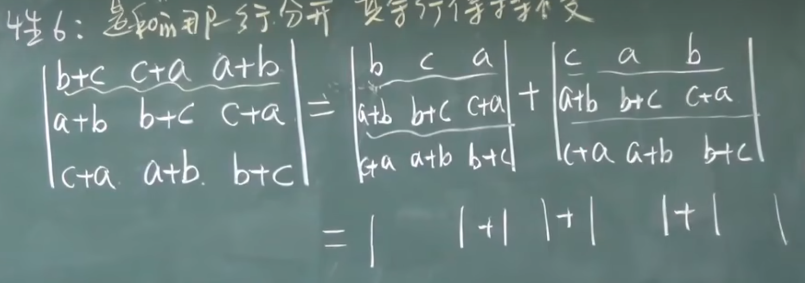
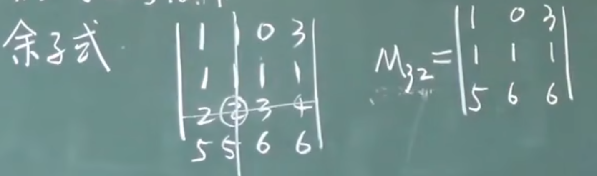
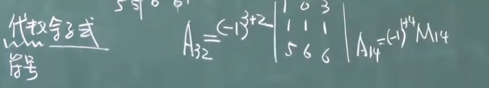
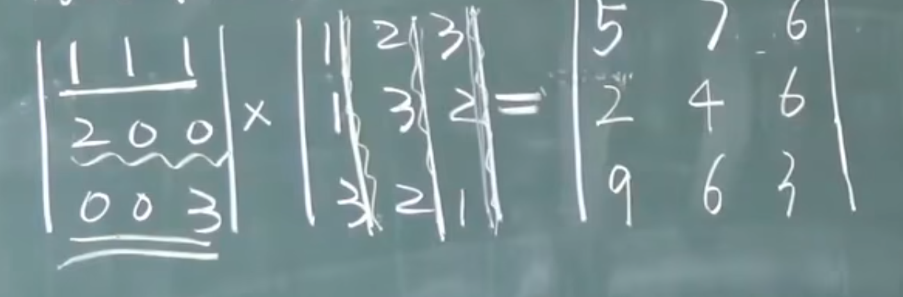
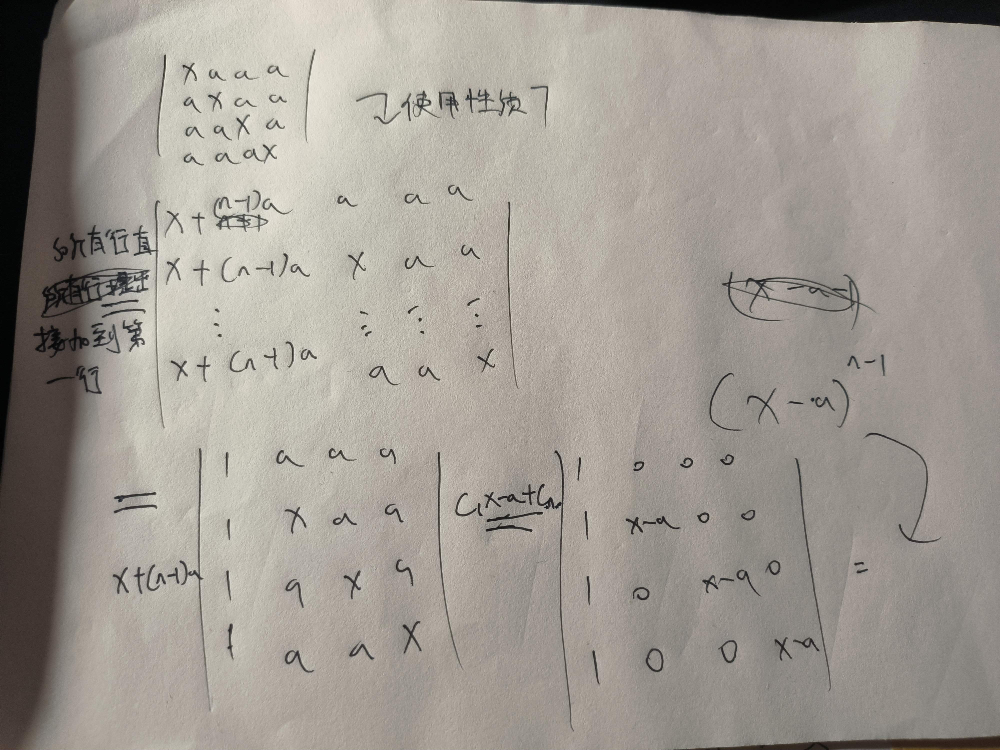
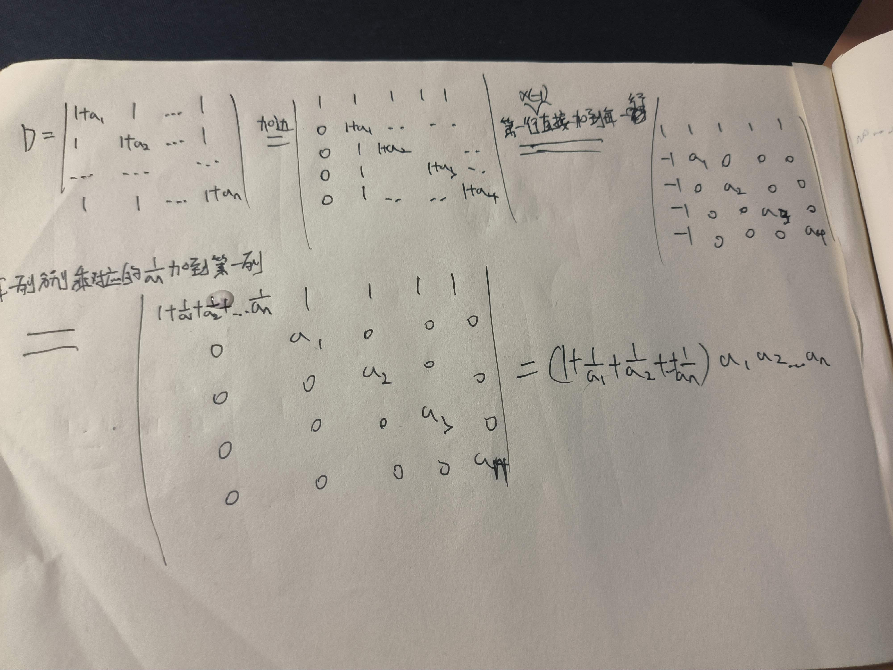
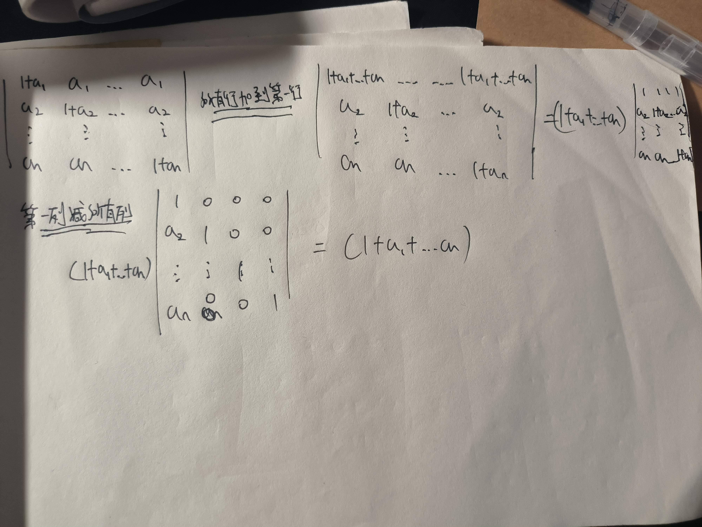
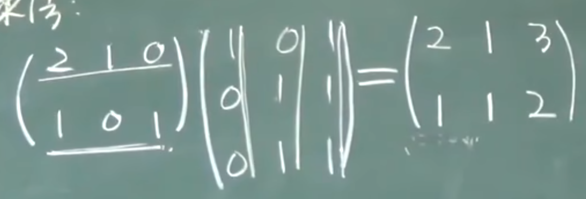

## 没看完的
## 没有排位置的(不知道放哪)
* AB != BA
* 矩阵不能放在分母上
* (n-1) + (n-2) + ... + 2 + 1 = n(n-1) / 2 
## 行列式, 排列
### 二阶行列式
$\left[ \begin{matrix}  a & b \\  c & d \end{matrix} \right] = ad - cb $
### 三阶行列式
$\left| \begin{matrix}  1 & 2 & 3 \\  4 & 5 & 6 \\ 7 & 8 & 9  \end{matrix} \right| $  
$= (1*5*9) + (2*6*7) + (4*8*3) - (3*5*7) + (6*8*1) + (2*4*9)$
### 排列  
* 排列 -- 由1, 2, ... ,n 组成的有序数组， 叫n级排列
    * 有序指的是固定顺序
        > 例 -- 3级排列包含 (1, 2, 3), (2, 1, 3), (3, 1, 2) 等等
    * 中间不能缺数
        > 例 --  4, 1, 5, 3 不是5级排列, 因为数组不包括2
    
    * n级排列共有 $n!$ 种

* 逆序 -- 大数排在小数前面
* 逆序数 -- 逆序的总数
    > 例 (4, 2, 1, 3)的逆序数  
    从4开始看, 4>2, 4>1, 4>3, 这是3个逆序  
    再看2, 2>1, 2<3, 这是1个逆序  
    再看1, 没有  
    所以逆序数为 3+1 = 4

* 偶排列, 奇排列 -- 逆序数为奇数或偶数则为对应的`偶排列`或`奇排列`

* 标准(自然)排列 -- 顺序为(1, 2, ..., n)的排列 
    * 标准排列的逆序数为 n(n-1)/2

* 对换 -- 交换两个数
* 定理1.1.1 -- 一个排列经过一次对换, 奇偶性改变
* 定理1.1.2 -- n级排列中, 奇偶排列各占一半
### n阶行列式
#### 按行展开
$ D = \left| \begin{matrix} 1 & 5 & 1 & 3 \\ 4 & 3 & 2 & 5 \\9 & 2 & 8 & 6 \\ 5 & 8 & 7 & 6\end{matrix} \right| = 1 * 3 * 8 * 6 + 1 * 2 * 2 6 + ... + 3 * 2 * 2 * 5$   
> 格式类似  
$ D = \left| \begin{matrix} a_{11} & a_{12} & a_{13} & a_{14} \\ a_{21} & a_{22} & a_{23} & a_{24} \\ a_{31} & a_{32} & a_{33} & a_{34} \\ a_{41} & a_{42} & a_{43} & a_{44} \end{matrix} \right|$  
$ = 
 a_{11} * a_{22} * a_{33} * a_{44} + a_{14} * a_{22} * a_{31} * a_{42} + a_{13} * a_{22} * a_{31} * a_{44}
$
* 行标取1, 2, 3, 4, 列标取{1234}排列的所有可能

#### 按列展开
* 将行转换为列, 类似按行展开
#### 三角行列式
$ D = \left| \begin{matrix} 1 & 0 & 1 & 3 \\ 0 & 3 & 2 & 5 \\0 & 0 & 8 & 6 \\ 0 & 0 & 0 & 6\end{matrix} \right| = 1 * 3 * 8 * 6$   
### 行列值的性质
#### 转置
$ D = \left| \begin{matrix}  0 & 1 & 3 \\  3 & 2 & 5 \\ 7 & 8 & 6  \end{matrix} \right|$   

$ D^T= \left| \begin{matrix}  0 & 3 & 7 \\  1 & 2 & 8 \\ 3 & 5 & 6  \end{matrix} \right|$
> 列变为行, 行变为列
#### 性质
* 性质:
    0. 对行成立的性质对列也成立

    1. $D^T = D$

    2. 两行互换, 值变号 

    3. 两行(列)相等, D = 0

    4. 某一行有公因子, 可以提到行列式外面去

    5. 两行对应成比例, D = 0
        * 推论: 某一行全为0, D = 0

    6. 行列式的某一行(列)是两数之和, 则此行列式可以表示为两行列式的和
        * 是和的那行(列)分开, 其余行不变
         

    7. 某一行(列)乘以一个数, 加到另一行(列)上去, D 不变
        
#### 解四阶行列式
* 思路一
    * 如果题目中 0 很少, 一般思路为转换为上三角行列式
        * 主要是使用上面的`性质7`, 少量使用`性质2`

* 思路二
    * 行列式D = 任意列(行)元素与对应的`代数余子式`相乘的结果之 和  

* 具体看[1.4 行列式的计算](https://www.bilibili.com/video/BV1aW411Q7x1/?p=5&share_source=copy_web&vd_source=6fcaeb589ebc683e202dd787a3b58143)
### 行列式按行(列)展开
#### 余子式
* $M_{32}$表示去掉x=3, y=2, 对应的`行`和`列`形成的子行列式

#### 代数余子式
* 相比于`余子式`多了正负号, -1的上标为 坐标对应的xy相加

#### 定理
* 定理1: (按某行(列)展开)    
    * 行列式D = 任意列(行)元素与对应的`代数余子式`相乘的结果和  
$D = a_{i1}A_{i1} + a_{i2}A_{i2} + ... + a_{in}A_{in}$

* 定理2: 某行元素与另一行元素的`代数余子式`乘积之和 = 0
#### 拉普拉斯定理 
* 当尝试使用按行(列)展开时, 选中两行和两列, 确定一个二阶子式, 再求出这个二阶子式的代数余子式, 展开时与直接按行(列)展开的原理一样  

* [这个讲得很明白](https://www.bilibili.com/video/BV1my4y1a7pD/?share_source=copy_web&vd_source=6fcaeb589ebc683e202dd787a3b58143)
#### 行列式相乘规则
* 下面这种方法`仅适用于同阶行列式`, 不同阶行列式相乘需要用`其他方法`, 比如`算出两个行列式具体的值`再相乘
* 步骤
    * 乘号`左边行列式第一行所有元素`分别乘`乘号右边第一列所有元素`再相加能得到结果行列式的单个元素
    * 完成结果行列式的所有元素

### 行列式的计算
#### 解四阶行列式
* 上三角
    * 如果题目中 0 很少, 一般思路为转换为上三角行列式
        * 主要是使用上面的`性质7`, 少量使用`性质2`

* 按行展开
    * 行列式D = 任意列(行)元素与对应的`代数余子式`相乘的结果之 和  

* 具体看[1.4 行列式的计算](https://www.bilibili.com/video/BV1aW411Q7x1/?p=5&share_source=copy_web&vd_source=6fcaeb589ebc683e202dd787a3b58143)

#### 特殊行列式
##### 对角线为x, 其余皆为a
$ D = \left| \begin{matrix} 
x & a & ... & a \\
a & x & ... & a \\
... & ... & x & ... \\
a & a & ... & x
\end{matrix} \right| $ 

##### 三叉型行列式
$ D = \left| \begin{matrix} 
1+a_1 & 1 & ... & 1 \\
1 & 1+a_2 & ... & 1 \\
... & ... &  & ... \\
1 & 1 & ... & 1+a_n
\end{matrix} \right| $   
* 需要使用`加边法`

###### 加边法
$ D = \left| \begin{matrix} 
1+a_1 & 1 & ... & 1 \\
1 & 1+a_2 & ... & 1 \\
... & ... &  & ... \\
1 & 1 & ... & 1+a_n
\end{matrix} \right| $   

$ = D_1 = \left| \begin{matrix} 
1 & 1 & 1 & ... & 1 \\
0 & 1+a_1 & 1 & ... & 1 \\
0 & 1 & 1+a_3 & 1 & 1\\
... & ... & ... & 1+a_4 & 1 \\
0 & 1 & 1 & ... & 1+a_n
\end{matrix} \right| $   
* 证明: 尝试将 D_1 使用第一行按行展开, 发现等于 D 这个四阶行列式 `(性质五: 推论: 某一行全为0, D = 0)`
##### 范德蒙德行列式
$ D = \left| \begin{matrix} 
1 & 1 & ... & 1 \\
x_1 & x_2 & ... & x_n \\
x_1^2 & x_2^2 &  & x_n^2 \\
x_1^3 & x_2^3 & ... & x_n^3 
\end{matrix} \right| = 
{II}_{i>j}(X_i-X_j)$
* 例:
$ D = \left| \begin{matrix} 
1 & 1 & 1 & 1 \\
a & b & c & d \\
a^2 & b^2 & c^2 & d^2 \\
a^3 & b^3 & c^3 & d^3 
\end{matrix} \right| $  

$ = (d-a)(d-b)(d-c)(c-a)(c-b)(b-a) $
* [实在看不懂了看一眼能让我看懂的视频](https://www.bilibili.com/video/BV1ts4y1V7s2/?share_source=copy_web&vd_source=6fcaeb589ebc683e202dd787a3b58143)
##### 对称行列式/反对称行列式
###### 对称行列式
$ D = \left| \begin{matrix} 
1 & 1 & -1 \\
1 & 2 & 0 \\
-1 & 0 & 3 
\end{matrix} \right| $
* 主对角线元素无要求
* 上下位置对应相等
###### 反对称行列式
$ D = \left| \begin{matrix} 
0 & 1 & 2 & 3 \\
-1 & 0 & -5 & 6 \\
-2 & 5 & 0 & 8 \\
-3 & -6 & -8 & 0 
\end{matrix} \right| $
* 特点
    * 主对角线全为0
    * 上下位置对应成相反数

* 如果是奇数阶, D = 0
* 偶数阶只能正常算
##### 对角线皆为 1+a_1
$ D = \left| \begin{matrix} 
1+a_1 & a_1 & ... & a_1 \\
1 & 1+a_2 & ... & 1 \\
... & ... &   & ... \\
1 & 1 & ... & 1+a_n 
\end{matrix} \right| $

### 克莱姆法则
* 仅适用于`方程个数 = 未知量的个数`

$  \begin{cases}
X_1 + X_2 + X_3 = a \\
X_1 - X_2 + 5X_3 = b & a, b, c 已知\\
-X_1 + X_2 + 6X_3 = c 
\end{cases} $  

* $X_j = {{D_j} \over {D}}$

* 系数行列式 D = 
$\left| \begin{matrix}  
1 & 1 & 1 \\
1 & -1 & 5 \\
-1 & 1 & 6  
\end{matrix} \right|$

* $D_1$ = 
$\left| \begin{matrix}  
a & 1 & 1 \\
b & -1 & 5 \\
c & 1 & 6  
\end{matrix} \right|$

* $D_2$ = 
$\left| \begin{matrix}  
1 & a & 1 \\
1 & b & 5 \\
-1 & c & 6  
\end{matrix} \right|$

* $D_3$ = 
$\left| \begin{matrix}  
1 & 1 & a \\
1 & -1 & b \\
-1 & 1 & c  
\end{matrix} \right|$
## 矩阵
* 是一些数按行按列构成的数表, 记作 $A_{m*n}$
* 数表使用 `()` 或 `[]` 括起来

### 单位矩阵
* 使用 `E` 或 `I` 来表示
* 对角线均为下标
* 除对角线外均为 0

$E_3$ = 
$\left( \begin{matrix}  
1 & 0 & 0 \\  
0 & 1 & 0 \\ 
0 & 0 & 1  
\end{matrix} \right)$
### 0 矩阵
* 两个0矩阵不一定相等
* 可能是

$\left( \begin{matrix}  
0 & 0 & 0 \\  
0 & 0 & 0 \\ 
0 & 0 & 0  
\end{matrix} \right)$
* 也可能是
$\left( \begin{matrix}  
0 & 0 & 0 \\  
0 & 0 & 0  
\end{matrix} \right)$
### 矩阵运算
#### 加(减)法 -> 对应元素相加(减)
* 只有同型矩阵才能相加减    
#### 数乘运算
* 矩阵所有元素均有`公因子`, 公因子外提一次
* 和行列式有区别的, 行列式一行(列)提一次
#### 矩阵乘法
* AB 之间有 `左乘`, `右乘`的区别
* 性质
    * $A_1*A_2$ != $A_2A_1$

    * AB 有意义, BA 不一定有意义
    * AB = 0, 推不出 A = 0 或 B = 0
    * AB = AC, A != 0, 推不出 B = C
    * 0矩阵和任意矩阵相乘都为0
        * $A_{4*3} * 0_{3*2}$ = $0_{4*2}$ 
    * 和单位矩阵E相乘结果不变
        * AE = A, BE = B
    * $(A+B)C \ne CA + CB$
    * $C(A+B) = CA + CB$
        * 区别在`左乘`和`右乘`
    * A, B 可交换 = A, B同阶 
* 前提条件
    * $A_1$行数 = $A_2$列数    
* 方法
    * `左第一行`和`右第一列` 对应数先相乘再相加得到$A_{11}$ 
    * `左第一行`和`右第二列` 对应数先相乘再相加得到$A_{12}$
    * 类推得到所有数 ``

* 宋浩的七字口诀 = `中间相等取两边`
* 例: $A_{4*6} * A_{6*5}$
    * 因为 中间的 6 和 6 相等, 所以这两个矩阵可以相乘, 矩阵的大小是 4*5    

#### 幂运算
* $A^K = AA...A$(k个)
* 规定 $A^0 = E$
* 一般来说, $(AB) \ne A^kB^k$
    * 因为展开后 $ABAB \ne AABB$
    * 有`左乘右乘`的关系
* 一般来说, $(A+B)^2 \ne A^2+2AB+B^2$
    * 展开来看 $(A+B)^2 = (A+B)*(A+B)$
    * 后面自己推一下
### 矩阵转置
$A = \left( \begin{matrix}  
1 & 2 & 3 \\
1 & 1 & 1 
\end{matrix} \right)$  

$A^T = \left( \begin{matrix}  
1 & 1 \\
2 & 1 \\
3 & 1  
\end{matrix} \right)$
* 性质
    * $(A^T)^T = A$ 
    * $(AB)^T = B^TA^T$
        * 证明在 `2.2(矩阵运算)29:28`
# 该看2.3 特殊矩阵了
