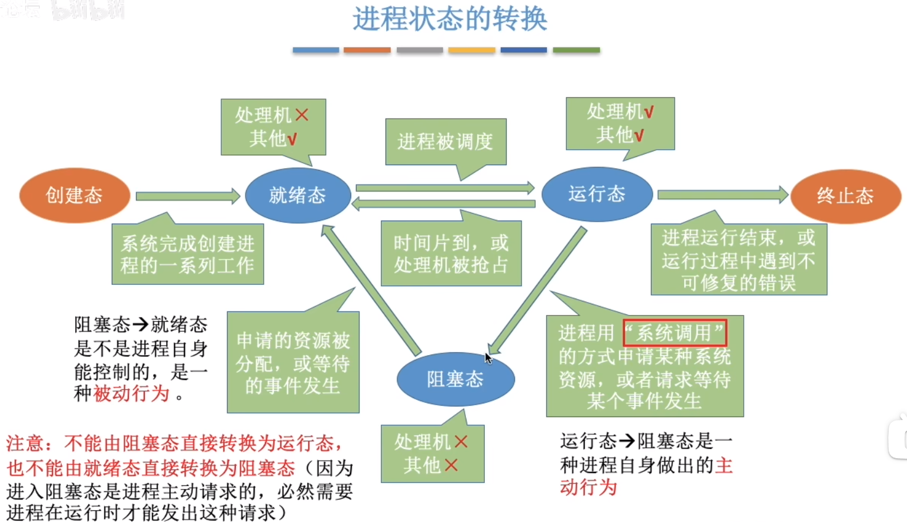
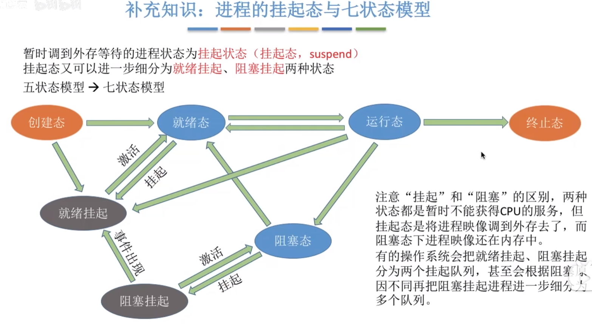
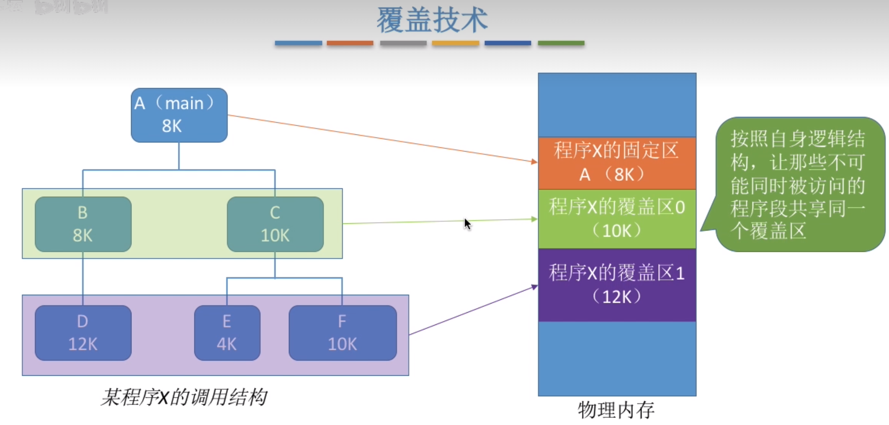
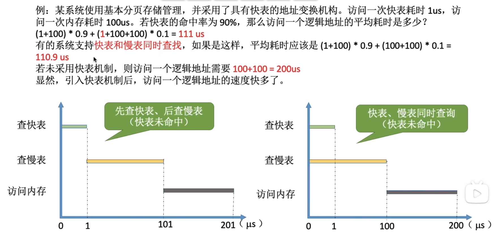
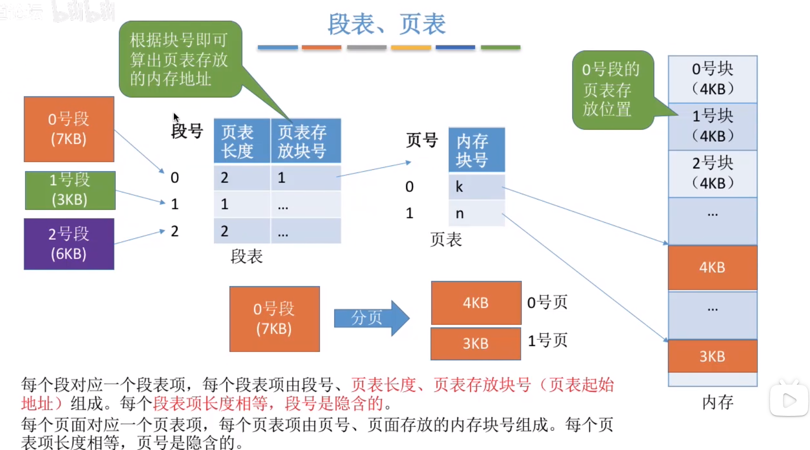
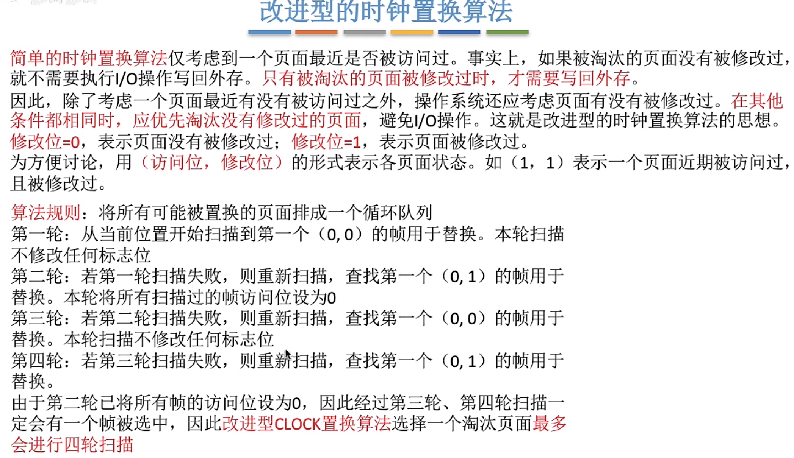

## 大写字母的查表 
`PID` -> `Process ID` -> `进程id`
`FCFS` -> `First Come First Service` -> `先到先服务`  
`HRRN` -> `Highest Response Ratio Next` -> `最高响应比调度`  
`PCB` -> `Process Control Block` -> `进程管理块`
`TCB` -> `Thread Control Block` -> `线程管理块` 
`SPF` -> `Shortest Process First` -> `最短作业优先` 和 `SJF` -> `Shortest Job First` 是一个东西  
`SRTN` -> `Shortest Remaining Time Next` -> `最短剩余时间优先`  
`RR` -> `Round robin` -> `时间片轮转`
`MLFQ` -> `multi-level feedback queue` -> `多级反馈队列调度算法`  
`TLB` -> `Translation Lookaside Buffer` -> `转译后备缓冲器`  
`OPT` -> `Optimal replacement` -> `最佳页面替换算法`  
`FIFO` -> `First In First Out` -> `先进先出置换算法`  
`LRU` -> `Least Recently Used` -> `最近最久未使用置换算法`  
`NRU` -> `Not Recently Used` -> `最近未用算法`，又叫`CLOCK算法`
## 进程
* 程序: 是静态的, 就是存放在磁盘里的可执行文件, 就是一系列的指令集合

* 进程: 是动态的, 是程序的一次执行过程
    * 同一个程序多次执行会对应多次进程

* 当进程被创建时, 操作系统会为该程序分配一个唯一的, 不重复的`PID` -- `Process ID`

* 进程的详细信息会被保存在PCB中(PID, 进程所属用户id(UID), 分配了多少内存, 磁盘使用情况等等)
### 进程的状态
* `创建态`: 创建进程

* `就绪态`: 程序可以运行了, 但是cpu还没有处理这个进程

* `运行态`: cpu正在处理的程序处于运行态

* `阻塞态`: 进程正在等待某个事件的发生(例如io等)

* `终止态`: 操作系统会让该进程下cpu, 并回收内存空间等资源, 最后还要回收该进程的PCB 

>* 不能由`阻塞态`直接转换为`运行态`
>* 不能由`就绪态`直接转换为`阻塞态`
>* 在`时间片算法`或`抢占式算法`中, 可以由`运行态`转换为`就绪态`(对应进程的抢占)  
>   * 阻塞态要先转换为就绪态才能到运行态
>   * 就绪态要先转换为运行态才能到阻塞态
* 进入阻塞态是进程主动请求的

* 进入就绪态是被动的, 受操作系统其他进程的影响

---
在408中为五状态模型, 在自主命题学校有可能为七状态模型

### 进程控制
// 看完了，没写
### 进程通信
// 没看
### 线程
//看完了，没写
从视频的2.1_5 ~ 2.2_4都没写
### 调度算法
* 各种时间的计算方法  
    * __周转时间__ = 结束时间 - 开始时间
    * __带权周转时间__ = 周转时间 / 运行时间
    * __等待时间__ = 周转时间 - 运行时间
    * __平均xx时间__ = 每个job的xx时间加起来 / job总数  
---
#### FCFS
First Come First Service  
先到先执行

__这是一种`非抢占式`的算法__  
__不会导致`饥饿`__  

---
#### SPF
Shortest Process First
>每次执行任务时选择执行时间最短的任务

__这是一种`非抢占式`的算法__  
__会导致`饥饿`__  

---
#### SRTN
Shortest Remaining Time Next
每次任务到达时比较执行时间，执行时间更短的job抢占cpu  

__这是一种`抢占式`的算法__  
__会导致`饥饿`__  

---
#### HRRN
Highest Response Ratio Next  

__响应比__ = (等待时间 + 要求服务时间) /要求服务时间      
>  当前 `job` 完成后计算所有队列中的 `job` 的`响应比`，接下来执行`响应比最大`的 `job`

__这是一种`非抢占式`的算法__  
__不会导致饥饿__

---
#### RR
Round robin  
给每个任务固定的时间片，如果任务未完成，当时间片到后切换下一个进程

__这是一种`抢占式`的算法__  
__不会导致饥饿__

---
#### 优先级调度算法
* 非抢占式  
>进程`完成`时进行调度，每次调度时选择已到达且优先级高的进程
* 抢占式
>进程`到达`时进行调度，每次调度时选择已到达且优先级高的进程

* 优先级一样时先到达的先执行  

__这是一种可`非抢占式`也可`抢占式`的算法__  
__可能会导致饥饿__

---
#### 多级反馈队列调度算法
multi-level feedback queue  
* 大多数linux分支使用的调度算法  

分为许多条`不同优先级的队列`，每个队列的时间片大小不相同，`高`优先级队列的时间片`小`，`低`优先级的时间片`大`  

当有`新job`进来时，会添加在`最高优先级`，新job会`直接抢占`cpu  

在队列中一定是优先级高的job处理完(job在时间片内处理不完就会进入下一级队列)后再处理下一个优先级  

当前执行队列的`时间片使用完`时，会将当前执行的job放到`下一优先级队尾`  

如果已经在`最低的优先级队列`了`时间片执行完`后job则会添加在`最低优先级队列队尾`

__这是一种`抢占式`的算法__  
__可能会导致饥饿__

---
### 进程互斥
* 进程的`并发`需要共享资源的支持, 这里有两种共享方式
    * 互斥共享方式 -- 一个时间段只允许一个进程访问资源
    * 同时共享方式 -- 一个时间段允许多个进程同时访问资源
## 银行家算法

写下来有点难，具体看b站吧  
【死锁 银行家算法】 https://www.bilibili.com/video/BV1kb41147CT/?share_source=copy_web&vd_source=6fcaeb589ebc683e202dd787a3b58143

---
## 内存
### 从写程序到程序运行
* 编辑源文件
* 编译 -> 由源文件生成目标模块
* 链接 -> 将目标模块链接为装入模块
* 装入 -> 将转入模块装入内存
### 三种链接方式  
* 静态链接 -> 装入前链接成一个完整模块

* 装入时动态链接 -> 装入时边装入边链接

* 运行时动态链接 -> 运行时目标模块才装入并链接
### 三种装入方式
* 绝对装入 -> 编译时产生`绝对地址`

* 可重定位装入 -> 装入时将逻辑地址转换为物理地址(提前设定了`固定偏移值`，每个地址装入时`逻辑地址+偏移值`就是`真实物理地址`)

* 动态运行时装入 -> 需要`重定位寄存器`(cpu支持)，将逻辑地址全部加上cpu生成的偏移值为物理地址
### 内存空间的扩充

* 设定`上限寄存器`和`下限寄存器` -> 访问地址时检查是否越界

* 设定`重定位寄存器`和`界地址寄存器` -> 当逻辑地址传来时与重定位寄存器相加，再与界地址寄存器`比较`，大于则越界
#### 覆盖技术

* 程序员`提前设定`好的内存段  

* 程序被设定为`许多段`，常驻的段`常驻`在内存，不常用的段在需要时被`调入`内存  

* 内存中分为`固定区`和`覆盖区`，不常用的段放置在覆盖区，当不适用时被`调出`内存  

* 缺点：对用户不透明，增加了编程负担

* 不常用，已退出历史舞台
#### 交换技术
* 操作系统`自动`将程序换出内存

* 只有`内存不够用`时将进程换出到外存

* PCB常驻在内存中

* 换出的程序存放在磁盘中的`交换区`

* 交换区为磁盘中的一片`连续区域`，连续区域的io性能相对更高
#### 虚拟存储技术
* 在程序装入时，可以将程序`很快会用到的部分装入内存，暂时用不到的部分留在外存，`就可以让程序开始执行

* 在程序执行过程中，当访问的信息不在内存时，由操作系统负责将信息从外存调入内存，然后继续执行程序

* 如果内存空间不够，由操作系统负责将内存中`暂时用不到的信息换出到外存`
### 连续分配管理
* 连续分配：指为用户进程分配的必须是一个`连续的内存空间`
#### 单一连续分配
* 内存被分为`系统区`和`用户区`，`系统区`通常处于`低地址部分`

* 内存中只能有`一道`用户程序，用户程序独占整个用户空间

* 优点：
    * 实现简单
    * 无外部碎片
    * 可以采用覆盖技术扩容内存

* 缺点：
    * 只能用于单用户，单任务的操作系统中
    * 有内部碎片
    * 处理器利用率极低
#### 固定分区分配 
* 将整个用户空间划分为`若干个固定大小`的分区，在`每个分区`中只装入`一道作业`

* 有分区大小`相等`和分区大小`不等`两种方式

* 需要建立一个`分区说明表`，表内容包括`分区号`，`分区大小`，`起始位置`，`状态(是否已分配)`

* 优点 -> 实现简单，无`外部碎片`

* 缺点
    * 会产生`内部碎片`，内存利用率低
    * 当程序过大时，可能会采用覆盖技术来解决
#### 动态分区分配
* 又称`可变分区分配`，不会预先划分内存分区，在进程装入内存时，根据进程大小动态建立分区

##### `系统要用什么样的数据结构记录内存的使用情况？`
>* 常用的两种数据结构
>      * 空闲分区表：表中包含`区号`，`分区大小`，`起始地址`
>
>      * 空闲分区链：每个分区的`前后部分`别设置`前向和后向指针`，起始部分可以记录分区大小等信息
##### `当有很多空闲分区都能满足需求时，应该选择哪个分区进行分配？`
> 根据具体的`动态分区分配算法`来决定
##### 动态分区分配算法
> 综合来看，首次适应算法的效果反而更好
* `首次适应算法`  
    * 每次都从`低地址`开始查找，找到第一个能满足大小的空闲分区

* `邻近适应算法`
    * 和`首次适应算法`类似，每次开始查找位置为上次查找结束的位置开始，和首次适应算法相比减少了查找的开销

* `最佳适应算法(最小适应算法)` 
    * 思想：优先使用`更小`的空闲分区
    * 实现方法：  
    空闲分区`按容量递增`次序链接，每次分配内存时按顺序查找，找到大小满足的`第一个`分区
    * 缺点：会产生越来越多，很小的，难以利用的外部碎片

* `最坏适应算法(最大适应算法)`
    * 思想：优先使用`更大`的空闲分区
    * 实现方法：  
    空闲分区`按容量递减`次序链接，每次分配内存时按顺序查找，找到大小满足的`第一个`分区
    * 缺点：大空闲区会越来越少，"大进程"达到后会没有合适分区可用
### 非连续分配管理方式
#### `页式`存储
* 将内存空间分为一个个`大小相等`的分区，一个分区就是一个`页框`(`页框` = `页帧` = `内存块` = `物理块` = `物理页面`)，每个页有编号，页号`从0开始`

* `页面`指的是`进程`在逻辑上被划分出的页，`页框`指的是`内存`在物理上被划分出的许多部分

* 将进程的逻辑地址空间分为和`页框大小相等`的一个个部分，每个页也有页面，页面`从0开始` 
##### 页表
* 操作系统为每一个进程创建一个`页表`，页表通常存在于PCB中

* 页表在储存时分为`页号`和`块号`，块号需要储存，页号不需要储存，可以隐式推断出来
---
>问题一：每个页表项占多少字节
> * 假设某系统物理内存大小为4GB，页面大小为4KB，则每个页表项至少为多少字节？  
>  
> * 答:  
>       内存大小 = 4GB = 2^32B  
>       页面大小 = 4KB = 2^12B       
>       页面数量 = 2^32 / 2^12 = 2^20  
>       则需要3Byte也就是24b来储存页面数量信息  
>       问的是字节所以是`3`字节
---
>问题二：如何实现地址的转换
>* 如果要访问逻辑地址address，则
>   * 确定逻辑地址address对应的`页号`page
>   * 找到page页面在内存的起始地址(需要查页表)
>   * 确定逻辑地址address的偏移量W 
>   * address的物理地址 = page的起始地址 + 偏移量W
---
##### TLB
* 概念
> 又称`联想寄存器`或者`快表`，是一种`访问速度比内存快很多`的高速缓存，存放的是最近使用的`逻辑地址`到`物理地址`的`转换`，可以加速地址变换的速度，于此对应，内存中的页表常称为`慢表`

* 当进程`切换`时，`快表`中的内容会被`清除`

* 当cpu发出请求时会`先从`TLB中查找表的数据，如果未命中，才会从内存中查找数据，从内存中获取数据后，会将获取的数据`也存放`到TLB中

*  如果`快表命中`，只需要进行一次`访存`
*  如果快表`未命中`，需要进行两次`访存`，当未命中时，操作系统需要从页表中获取正确的`映射关系`。`第一次`访存是为了获取页表的入口，`第二次`访存是为了从页表中获取实际的物理地址

* 第三种查询方式：快表慢表同时查询

* 当开始查询时快表和慢表同时开始查找，如果命中则访问数据，如果未命中则等待慢表查询到再访存，`可以节省一次查找快表的时间`
##### 局部性原理
* 时间局部性：如果执行了程序中的某条指令，不久后这条指令有可能被再次执行，如果某个程序被访问过，不久后该数据有可能被再次访问。

* 空间局部性：一旦程序访问了某个储存，不久之后，其附近的存储单元也有可能被访问
##### 多级页表
> 二级页表的结构
* 在TLB -> 内存块的基础上又增加了一层页表查询，
  结构为 页目录表 -> 二级页表 -> 内存块

> 如果是32kb的逻辑地址空间  

  如果`一级页表`的结构，地址结构为  
  
  |31......12|11......0|
  |--|--|
  |页号|页内偏移量|

  如果是`二级页标`的结构，地址结构为
  |31......22|21......12|11......0|
  |--|--|--|
  |一级页号|二级页号|页内偏移量|

* 一级页表的存储的是二级页表的块信息，二级页表中存储的是内存块信息
###### 各级页表的大小不能超过一个页面
> 某系统按字节编址，采用40位逻辑地址，页面大小为4KB，页表项大小为4B，假设采用纯页式存储，则要采用(3)级页表，页内偏移量为(12)位
>
> 因为页面大小为4KB，所以`页内偏移量`为2^12B，即需要`12位`来储存页内偏移量信息
>   
> 剩余28位来储存页表信息，28位只需要存储剩余页表的地址信息，页面大小=2^12B，页表项大小=4B，每个页面可存放2^12 / 4 = 2^10个页表项  
>
> 因此二，三级页表使用10位，一级页表使用8位，共使用28位，`使用三级页表`
###### 两级页表的访存次数分析
* 第一次访存：访问内存中的页目录表(`获取目标二级页表的物理地址`)
* 第二次访存：访问内存中的二级页表(`获取目标内存单元的物理地址`)
* 第三次访存：访问目标内存单元
#### 基本`分段`存储管理方式
##### 分段
* 进程的地址空间：按照程序自身的逻辑关系`划分为若干个段`，每个段都有段名，`每个段从0开始编址`

* 内存分配规则：以段为单位进行分配，每个段在内存中占据连续内存空间，但`各段之间可以不相邻`  

* 分段系统的逻辑地址结构  
 
|31......16|15......0|
|--|--|
|段号|段内偏移量|

* 段表的逻辑地址结构

|段号|段长|基址|
|-|-|-|
|0|7k|80k|
|1|3k|120k|
|2|6k|40k|
> `段号`可以是`隐含`的，不占内存空间
>
> 假设物理内存大小4G，其中段号16位，段内地址16位，如何推断出每个段表项的大小  
> 因为段表需要储存`段长`和`物理地址`，所以需要16+32=48位 = 6字节 来存储

> 访问一个逻辑地址需要几次访存
>  * 第一次访存：查内存中的段表
>  * 第二次访存：访问目标内存单元
#### 分段分页的`对比`
* 分页的主要目的是为了实现离散分配，提高内存利用率。分页仅仅是系统管理的需要，完全是系统行为，对用户`是不可见的`

* 分段的主要目的是更好地满足用户需求。一个段通常包含着一组属于一个逻辑模块的信息。分段对用户是可见的。

* 分段比分页`更容易实现信息的共享和保护`，分段式系统的`不同程序可以访问同一个段`，只有`纯代码`和`可重入代码`可以被共享
#### 段页式管理方式
* 将进程按逻辑模块分段，再将各段分页

* 逻辑地址结构

|31......16|15......12|11......0|
|-|-|-|
|段号|页号|页内偏移量|
* 段号的位数决定了每个进程最多可以分为几个段

* 页号位数决定了每个段最大有多少页

* 页内偏移量决定了页面大小，内存块大小是多少

* 总共需要进行`三次访存`：
第一次访存：访问内存当中的段表  
第二次访存：访问内存当中的页表
第三次访存：访问最终目标内存单元

* 也可引入`快表`机制，用段号和页号作为查询快表的关键字，若快表命中，`只用一次访存`
### 请求分页管理方式
#### 页表机构
* 请求分页存储管理的页表  

|页号|内存块号|状态位|访问字段|修改位|外存地址|
|-|-|-|-|-|-|
|0|无|0|0|0|x|
|1|b|1|10|0|y|
|2|c|1|6|1|z|

* 状态位：是否在内存当中
#### 缺页中断机构
> 在请求分页系统中，当要访问的页面不在内存中时，就产生一个`缺页中断`，然后由操作系统的缺页`中断处理程序处理中断`  
此时`缺页的进程阻塞`，放入阻塞队列，调页完成后再将其唤醒，放回就绪队列  
* 如果内存中`有空闲块`，则为进程`分配一个空闲块`，将所缺页面装入该块，并修改页表中相应的页表项  
* 如果内存中`没有空闲块`，则由页面置换算法选择一个页面淘汰，若该页面再内存期间`被修改过`，则要将其`写回外存`
#### 地址变换机构
* 在具有快表机构的请求分页系统中，访问一个逻辑地址时，若`发生缺页`，则地址变换步骤是：
>查快表(未命中) -> 查慢表(发现未调入内存) -> 调页(调入的页面对应的表项会直接加入快表) -> 查快表(命中) -> 访问目标内存单元
### 页面置换算法
* 页面的换入，换出需要磁盘I/O，会有较大的开销，因此好的页面置换算法应该追求更少的缺页率

* `缺页中断`未必发生`页面置换`，若还有可用的空闲内存块，就不用进行页面置换  

* 缺页率 = 缺页次数 / 访问页面次数
#### OPT
* 最佳置换算法(Optimal):每次选择`淘汰的页面`将是以后`永不使用`或者是`在最长时间内不再被访问的页面`，这样可以保证最低的缺页率

* 最佳置换算法可以保证最低的缺页率，但实际上，只有在进程执行的过程中才能知道接下来会访问哪个页面，操作系统无法提前预判页面访问序列。因此,`最佳置换算法是无法实现的`
#### FIFO
* 先进先出置换算法(FIFO)：每次选择淘汰的页面时最早进入内存的页面

* 实现方法：按照页面调入顺序排除队列，换出时选择队列头页面

* `belady异常`：当为进程分配的物理块数增大时，缺页次数不减反增的异常现象

* `只有FIFO算法会导致belady异常`，虽然算法实现简单，但是算法性能差
#### LRU
* 最近最久未使用置换算法(Least Recently Used)：每次淘汰的页面是`最近最久为使用的页面`

* 实现方法：赋予每个页面对应的页表项中，用访问字段记录该页面自上次被访问以来所经历的时间t，当需要淘汰页面时，选择t值最大的页面

* 算法的实现需要专门的硬件支持，虽然算法`性能好`，但是`实现困难，开销大`
#### ClOCK
* 时钟置换算法(CLOCK)：又叫NRU(Not Recently Used)算法
##### 简单时钟置换算法
* 实现方法：为每个页面设置一个`访问位`,将内存中的每一个页面通过`指针`链接为一个循环队列，当某页被访问时，访问位设为1，当淘汰一个页面时，只需检查页的访问位。`如果是0，就选择将页换出，如果是1，则将其置为0`，继续扫描下一个页面，如果`第一轮扫描`所有页面都是0，将所有访问位都置为0后进行`第二次扫描`(第二次扫描一定会有访问位为0的页面，因此简单的CLOCK算法选择淘汰页面最多会经历两次扫描)
##### 改进型的时钟置换算法
* 优先淘汰没有被修改过的页面

* 一次淘汰最多进行四次扫描
1. 第一优先级：最近没访问，且没修改的页面
2. 第二优先级：最近没访问，且修改过的页面
3. 第三优先级：最近访问过，且没修改的页面
4. 第四优先级：最近访问过，且修改过的页面

### 页面分配策略
* `驻留集`: 请求分页存储管理中给进程分配的物理块的集合
    * 若`驻留集太小`, 会导致缺页频繁, 系统要花大量的时间来处理缺页, 世纪用于进程推进的时间很少
    * `驻留集太大`, 又会导致多道程序并发度下降, 资源利用率降低, 所以应该选择一个合适的驻留集大小

* 驻留集的`分配策略`
    * `固定分配`: 分配物理块的大小后, 大小不再变化
    * `可变分配`: 驻留集大小可变
* 驻留集的`置换策略`
    * `局部置换`: 发生缺页时只能选择进程自己的物理块进行置换
    * `全局置换`: 可以选择内存中空闲的空间分配给进程, 也可以将别的进程的物理块换到外存, 再分配给缺页进程
    >* 全局置换一定是可变分配

* 也就是说, 有三种分配置换策略
    * `固定分配局部置换`: 灵活度较低  
    * `可变分配全局置换`
    * `可变分配局部置换`

**可变分配全局置换**

刚开始会为每个进程分配一定数量的物理块，操作系统会保持一个空闲物理块队列；  
当某进行发送缺页时，从空闲物理块中取出一块分配给该进程；若已无空闲物理块，则可选择一个未锁定的页面换出外存，再将该物理块分配给缺页的进程。  
采用这种策略时，只要某进程发生缺页，都将获得新的物理块，仅当空闲物理块用完时，系统才会选择一个未锁定的页面调出，被选择调出的页可能是系统中任何一个进程的页，因此该被选中的进程物理块会减少，缺页率增加。

**可变分配局部置换**

刚开始为每个进程分配一定数量的物理块，当某进程发生缺页时，只允许从该进程自己的物理块中选出一个进行换出外存；  
如果进程在运行中频繁缺页，系统会为该进程多分配几个物理块，直至该进程缺页率趋势到适当程度；反之，如果进程在运行中缺页率极低，则可适当的减少分配给该进程的物理块；

>自己理解的这俩的区别  
简单来说, `可变分配全局置换`, 当缺页时, 空闲空间中获取物理块, 当空闲块使用完时, 会从其他进程中扯过来物理块使用
>  
>`可变分配局部置换`, 不从空闲空间中获取物理块, 也不抢其他进程的物理块, 但是系统仍然会适度减少或增加物理块数量
#### 后面的没看完, 原视频的3.2_4
### 内存映射文件
当程序要访问外存中的文件时, 都是按块读取

传统方法 -- 将文件需要读入的部分读入, 需要调用read()来指定读入大小, 当保存时需要调用write()函数来写回外存

内存映射文件 -- 根据需求建立文件块到内存的映射, 内存映射文件允许应用程序将文件视为一块直接可访问的内存, 而对内存的修改会自动同步到文件中, 在内存中加载的是内存到外存文件块的映射关系