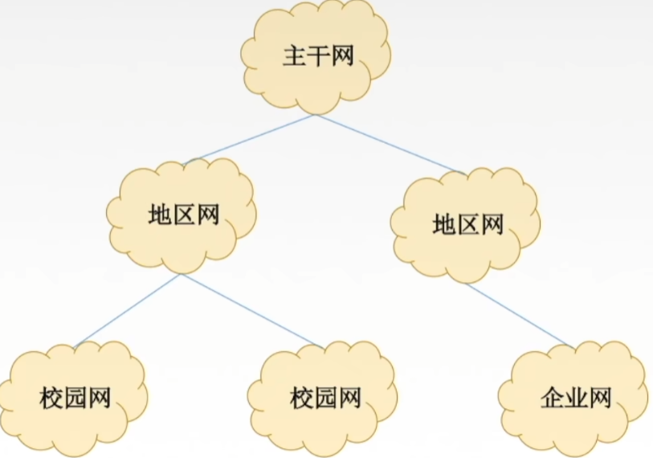

## 概念 -- 感觉都挺扯, 想删就删了
* 计算机网络是`互连`的, `自治`的计算机集合
    * `互连` - 通过通信链路互联互通
    * `自治` - 无主从关系 
* 计算机网络的功能
    1. 数据通信
    2. 资源共享
    3. 分布式处理
    4. 提高可靠性
    5. 负载均衡
## 计算机网络的发展
### 第一阶段
* `ARPAnet` -- 美国国防部高级研究计划局(ARPA)设计一个分散的指挥系统 
    * `ARPAnet` 的下一代是 `Internet`

* `internet` -- (interconnected network)互联网
    * 1983年阿帕网接受 TCP/IP 选定 Internet 为设计的计算机通信系统
### 第二阶段 - 三级结构
* `NSFNET` -- 1985年起, 美国国家科学基金会 NSF 围绕6个大型计算机中心建设计算机网络, 即国家科学基金网 `NSFNET`  

### 第三阶段 - 多层次ISP结构
* `ISP` -- 因特网服务提供者 / 因特网服务提供商, 是一个向广大用户综合提供互联网接入业务, 服务业务和增值业务的公司, 如中国电信, 中国联通, 中国移动等, 分为主干ISP, 地区ISP和本地ISP
# 该看1.1_2了