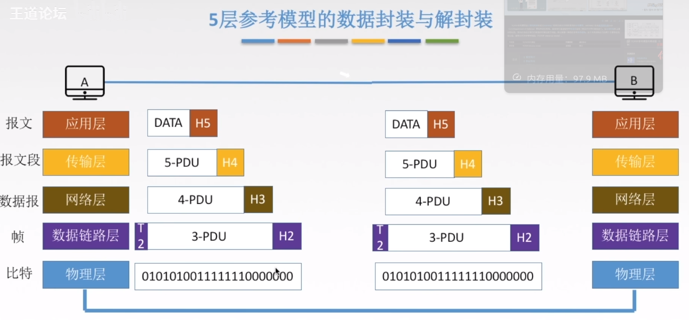
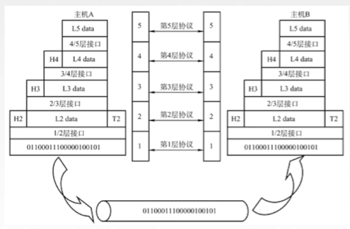

# 第一章 计算机网络体系结构
## 计算机网络的发展
### 第一阶段
* `ARPAnet` -- 美国国防部高级研究计划局(ARPA)设计一个分散的指挥系统 
    * `ARPAnet` 的下一代是 `Internet`

* `internet` -- (interconnected network)互联网
    * 1983年阿帕网接受 TCP/IP 选定 Internet 为设计的计算机通信系统
### 第二阶段 - 三级结构
* `NSFNET` -- 1985年起, 美国国家科学基金会 NSF 围绕6个大型计算机中心建设计算机网络, 即国家科学基金网 `NSFNET`  

### 第三阶段 - 多层次ISP结构
* `ISP` -- 因特网服务提供者 / 因特网服务提供商, 是一个向广大用户综合提供互联网接入业务, 服务业务和增值业务的公司, 如中国电信, 中国联通, 中国移动等, 分为主干ISP, 地区ISP和本地ISP
## 计算机网络的构成
* 工作方式
    * 边缘部分 用户直接使用
        * C/S方式 -- Client/Server
        * P2P方式 -- peer-to-peer
    * 核心部分 为边缘部分服务

* 功能组成
    * 通信子网 -- 实现数据通信
    * 资源子网 -- 实现资源共享 / 数据处理
 
* 资源子网 -> 应用层 
* 资源子网 -> 表示层
* 资源子网 -> 会话层
>意思是这三项为资源子网, 下面的通信子网也同理

* 传输层

* 通信子网 -- 网络层 -- 路由器
* 通信子网 -- 数据链路层 -- 交换机, 网桥
* 通信子网 -- 物理层 -- 集线器, 中继器
## 计算机网络的分类
* 按分布范围 -- `广域网WAN`, `城域网MAN`, `局域网LAN`, `个人区域网PAN`
    * 区分`广域网`和`局域网`
        * `广域网`使用交换技术
        * `局域网`使用广播技术

* 按使用者
    * 公用网
    * 专用网

* 按交换技术
    * 电路交换 -- 只能等别人使用完, 才能下一个人使用
    * 报文交换 -- 一次性传输一段报文
    * 分组交换 -- 分组传输报文的一部分, 多组传

* 按拓扑结构分
    * 总线型
    * 星型
    * 环形
    * 网状型

* 按传输技术分
    * 广播式网络 -- 共享公共通信信道
    * 点对点网络 -- 使用分组存储转发和路由选择机制
## 性能指标
### 速率
* 连接在计算机网络上的主机在数字信道上传输数据位数的速率
* 单位是 b/s, kb/s, Mb/s, Gb/s, Tb/s
### 带宽 (真会, 不重要)
### 吞吐量(真会, 不重要)
* 表示在单位时间内通过某个网络(或信道, 接口)的数据量
* 吞吐量受网络的带宽或网络的额定速率的限制
### 时延
* 指数据(报文, 分组, 比特流)从网络(或链路)的一端传送到另一端所需的时间, 也叫延迟或迟延, 单位是s

* 分为四种
    * 发送时延(传输时延) -- 从发送分组的第一个比特算起, 到该分组的最后一个比特发送完毕所需的时间
    * 综合了 OSI 和 TCP/IP 的优点

|    > $发送时延 = {{-|数据长度} \over {信道带宽(发送速率)}}$支持各种网络应用 _FTP, SMTP, HTTP_

|    _TCP, 进程-进程的数据传输 UDP* 传_播时延| -- 源主机到目的主机的数据分组路由和转发 取决于电磁波传输速IP, ICMP, OSPF度_和链路长度Ethernet, PPP|
    >_ $数据链路层 |= {{信道长度} _\把网络层传下来的数据报组装成帧 o_ver {电磁波在|层信道上的传播比特传输速率}}$
    
    * 排队时延 -- 等待输出 / 入链路可用

    * 处理时延 -- 检错找出口
#### 要注意的
* 高速链路 -- 仅影响发送时延, 数据被推送到链路上的速度加快, 不会影响其他时延
### 时延带宽积
* 描述此时信道中有多少比特

>时延带宽积 = 传播时延 * 带宽 
### 往返时延RTT
* 从发送数据开始, 到发送方收到接收方的确认(立即确认)共经历的时延 

* RTT越大, 在收到确认之前, 可以发送的数据越多

* RTT包括
    * 往返传播时延 = 传播时延 * 2
    * 末端处理时间 
### 利用率
* 包括
    * 信道利用率
    >$信道利用率 = {{有数据通过时间} \over {(有+无)数据通过时间}}$
    * 网络利用率
    >$网络利用率 = 信道利用率加权平均值$
## 分层结构
* 实体 -- 第n层中的活动元素称为n层实体, 同一层的实体叫对等实体

* 协议 -- 为进行网络中的对等实体数据交换而建立的规则, 标准, 或约定称为网络协议(水平方向上) 

    * 语法 -- 规定传输数据的格式
    * 语义 -- 规定所要完成的功能
    * 同步 -- 规定各种操作的顺序

* 接口(访问服务点SAP(Service Access Point)) -- 上层使用下层服务的接口

* 服务 -- 下层为相邻上层提供的功能调用
    
    * SDU 服务数据单元 -- 为完成用户所要求的功能而应传送的数据
    * PCI 协议控制信息 -- 控制协议操作的信息 
    * PDU 协议数据单元 -- 对等层次之间传送的数据单位

    * PCI + SDU = PDU

## OSI(法定标准)
* OSI(Open System Interconnect)
    * 理论成功, 市场失败

|七层||
|-|-|
|应用层|7|
|表示层|6|
|会话层|5|
|传输层|4|
|网络层|3|
|数据链路层|2|
|物理层|1|

>* 上面四层是端到端的通信, 下面四层是点到点的通信

* data数据从应用层开始打包, 每层打包后一直到`物理层`会传输到其他设备, 其他设备接收到数据后再层层解包为原始data数据

* 应用层 -- 所有能和用户交互产生网络流量的程序
    * 文件传输(FTP)(File Transfer Protocol)  
    * 电子邮件(SMTP)(Simple Mail Transfer Protocol)  
    * 万维网(HTTP)  

* 表示层 -- 用于处理两个通信系统中交换信息的表示方式
    * 数据格式变换 -- ...010101010... -> ${一张图片}
    * 数据加密解密
    * 数据压缩恢复

* 会话层 -- 向表示层 实体/用户 进程提供`建立连接`并在连接上有序地传输数据
    * 建立, 管理, 终止会话
    * 使用校验点使会话在通信失效时从 校验点/同步点继续恢复通信, 实现数据同步
        * 适用于传输大文件

* 传输层 -- 负责主机中两个进程的通信, 即端到端的通信, 传输单位是报文或用户数据报
    * 可靠传输, 不可靠传输 -- 区别有确认机制和需不需要提前建立连接
    * 差错控制 -- 纠错数据
    * 流量控制 -- 控制流量流速
    * 复用分用 
        * 在复用的情况下，多个应用程序的数据可以一起发送，通过不同的端口号来区分每个应用程序的数据流
        * 分用的情况下，一次只会发送一个应用程序的数据，然后根据端口号来将接收到的数据分发给正确的应用程序
        * 综合了 OSI 和 TCP/IP 的优点

* 网络层 -- 把分组从源端传输到目的端, 为分组交换网上的不同主机提供通信
* 网络层传输单位是`数据报`

* 功能一: 路由选择
* 功能二: 流量控制
* 功能三: 差错控制
* 功能四: 拥塞控制

 * 差错控制 -- 纠错
* 把网络层传下来的数据报组装成帧 拥_塞控制 -- 若所有节点都来不及比特传输接收分组, 而要丢弃大量分组的话, 网络就处于拥塞状态, 因此要采取一定措施, 缓解这种拥塞

* 数据链路层 -- 主要任务是把网络层传下的数据报组装成`帧`
    * 数据链路层/链路层的传输单位是`帧`
    
    * 成帧 (定义帧的开始和结束) 
    * 差错控制 (帧错+位错)
    * 流量控制
    * 访问(接入控制) `控制对信道的访问`

* 物理层 -- 在`物理媒体`上实现比特流的`透明传输`, 传输单位是`比特`
    * 透明传输 -- 不管数据是什么比特组合, 都应当能在链路上传输
    比特信号 -> 模拟信号

    * 定义接口特性
    * 定义传输模式 
        * 单工 -- 只能单向传输  
        * 半双工 -- 两边都可以作为发送方, 但是同一时间只能有一方传输
        * 双工 -- 可以双向同时说话
    * 定义传输速率
    * 比特同步
    * 比特编码
## TCP/IP 参考模型
|四层|
|-|
|应用层|
|传输层|
|网络层|
|网络接口层|
## 五层参考模型
* 综合了 OSI 和 TCP/IP 的优点

|五层||
|-|-|
|应用层|支持各种网络应用 _FTP, SMTP, HTTP_|
|传输层|进程-进程的数据传输 _TCP, UDP_|
|网络层|源主机到目的主机的数据分组路由和转发 _IP, ICMP, OSPF_|
|数据链路层|把网络层传下来的数据报组装成帧 _Ethernet, PPP_|
|物理层|比特传输|

# 第二章 物理层
* 物理层解决如何在连接各种计算机的传输媒体上`传输数据比特流`, 而不是指具体的传输媒体

* 物理层主要任务: 确定与传输媒体接口有关的一些特性 -> 定义标准

1. 机械特性: 定义物理连接的特性, 规定物理连接时所采用的规格, 接口形状, `引线数目, 引脚数量`和排列情况

2. 电气特性: 规定传输二进制位时, 线路上信号的`电压范围`, 阻抗匹配, 传输速率和距离限制等

3. 功能特性: 指明某条线上出现的某一电平表示什么意义, 接口部件的信号线的用途

4. 规程特性: 定义各条物理线路的工作规程和时序关系
## 相关术语
* 信号:
    * 数字信号/离散信号: 代表消息的参数的取值是离散的
    * 模拟信号/连续信号: 代表消息的参数的取值是连续的

* 信源: 产生和发送数据的源头
* 信宿: 接收数据的终点
* 信道: 信号的传输媒介, 一条通信线路往往包含一条发送信道和接受信道
# 在看 2.1_2
